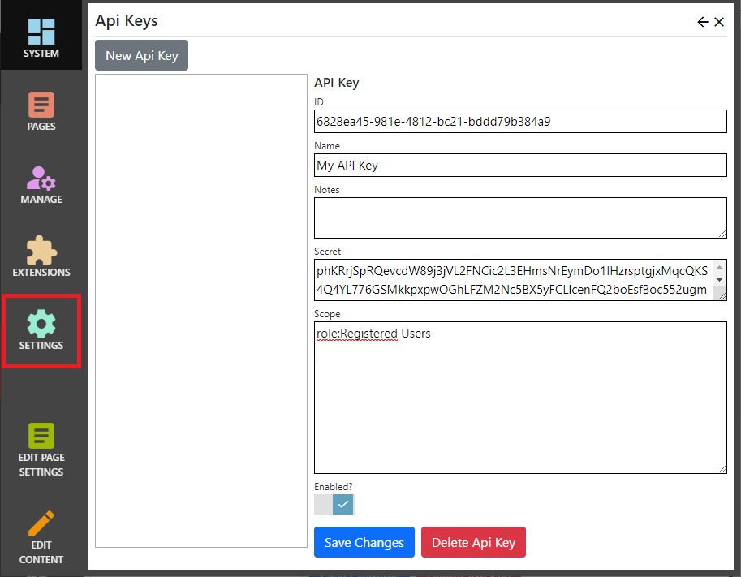

## Api Keys
To manage Api Keys, click "Settings", then choose "Api Keys".

The Api Keys editor is used to manage access keys and shared secrets.  Api Keys may be used to authenticate inbound requests when applications (rather 
than users) access Nucleus endpoints.  The search feeder uses an Api Key to identify itself when retrieving page content for the search index, and 
other Nucleus extensions or external applications can use Api Keys to authenticate themselves when sending a request to Nucleus.

## Properties

{.table-25-75}
|                                  |                                                                                      |
|----------------------------------|--------------------------------------------------------------------------------------|
| ID                               | The Api Key ID is the "access key" |
| Name                             | The name for the Api Key, used for your reference only.  |
| Notes                            | Your notes for the Api Key.  You can add information on who the key was assigned to, it's intended use and any other information that you require.  Notes are displayed in the Api Key editor only.  |
| Secret                           | The secret is an auto-generated string, which is shared with the user of an Api Key, and is used to create an Authentication token.  |
| Scope                            | One of more scopes, separated by line feeds.  Scopes specify the access rights for the Api Key.  Extensions can implement their own scope checking, and Nucleus automatically recognizes scopes in the form `role:role-name`.  |
| Enabled                          | Specifies whether the Api Key is enabled.  |

### Making a request using an Api Key
Applications which make Http requests to Nucleus must specify an Authorization header, with a "scheme" of `Nucleus-HMAC256` and a value which 
is generated using values from the request and the shared secret.  The [Nucleus.Extensions.HttpRequestExtensions](/api-documentation/Nucleus.Extensions.xml/Nucleus.Extensions.HttpRequestExtensions/) 
class contains a `.Sign` method which will add the header to a Http Request object.  Application developers who do not want to reference the 
Nucleus.Extensions assembly can copy the [source code](https://github.com/Inventua/nucleus-core/blob/main/Nucleus.Extensions/HttpRequestExtensions.cs) 
into their project.