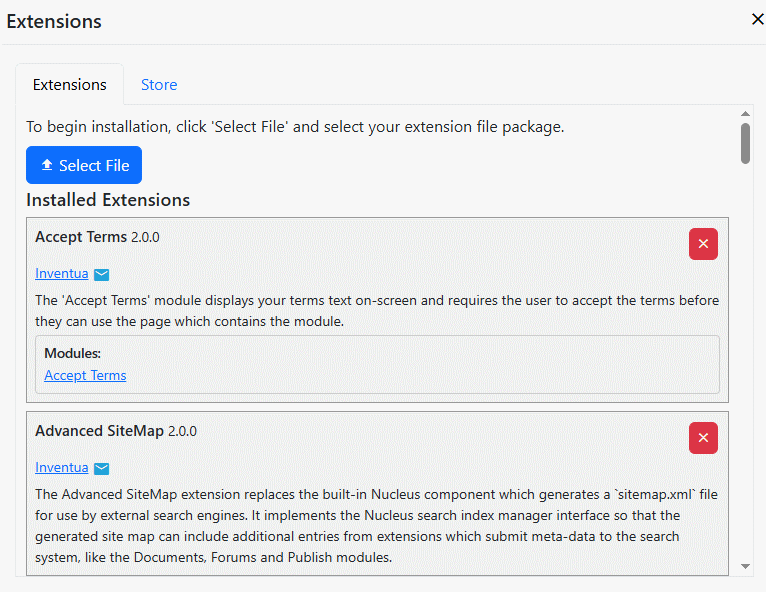

## Installing Extensions
After logging in as a system administrator or site administrator, you can manage extensions by clicking the `Extensions` button.

You can install or upgrade an extension by clicking `Select File`.  After you select your extension package, a wizard will guide 
you through the installation process.

In the list of installed extensions, you can click the publisher name to visit their web site, or the email icon to start a new email.  You can 
uninstall an extension by clicking the red 'X' button to the right. You can also click the links for modules, layouts or other components in 
each listed extension to view where that are used.

> After you install or uninstall an extension, Nucleus will shut down.  If you are hosting using IIS, Azure App Service, or you are are using
Docker or Linux and have configured auto-restart, your site will restart automatically.  A restart progress indicator is displayed during 
restart, and when your site has restarted, an on-screen message will say 'Restart Complete.'

### Store
The store tab displays available extensions, with links to download and install them.