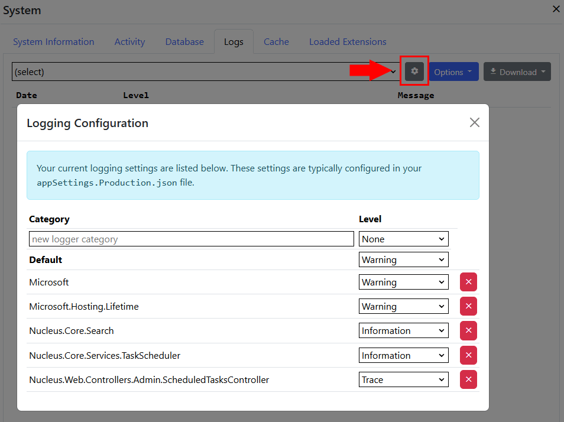

# Logging
Nucleus includes a console, debug, text file and Azure Web App Diagnostics logger.  The debug logger write logs to an attached debugger.  

The Text File logger writes text file logs, which are stored in the `C:\ProgramData\Nucleus\Logs` folder by default, in files named dd-MMM-yyyy.log.  
Text file logs are automatically deleted after 7 days by default.  If you are hosting in an Azure App Service, you must configure to the text file logger 
to write to `%HOME%/LogFiles/Application` or another writable folder by adding an entry to the Nucleus section of the `appSettings.{environment}.json` 
configuration file:

    "TextFileLoggerOptions": 
    {
      "path": "%HOME%/LogFiles/Application"
    },

Scheduled task logs are intercepted by the text file logger and are also written to the `C:\ProgramData\Nucleus\Logs\Scheduled Tasks\{Task Name}` folder.

You can manage log levels and categories in the Log Settings Editor, which is in the `Logs` tab in the `System` control panel.

Logging settings are configured in `appSettings.[environment].json`.  Refer to the [Configure Logging](https://docs.microsoft.com/en-us/aspnet/core/fundamentals/logging#configure-logging)
section of the Microsoft ASP.NET core documentation for details.

