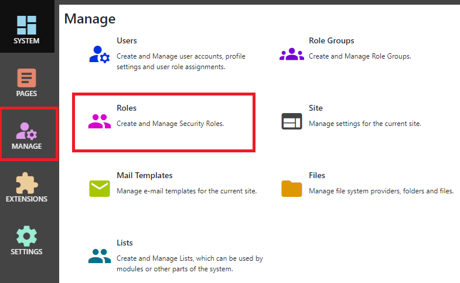

## Roles
Roles are used to assign permissions to users. Users can be assigned to multiple roles, and pages, modules, folders and other entities can
assign specific permissions, like ""View"" or ""Edit"" to multiple roles.

If a user is in any role which has a permission, the user has that permission.

After logging in as a system administrator or site administrator, you can manage roles by clicking the `Manage` button to display the Manage 
control panel, then click `Roles`.

## Properties

{.table-25-75}
|                  |                                                                                      |
|------------------|--------------------------------------------------------------------------------------|
| Name             | The name of your role.  This is displayed anywhere that administrators need to select roles. |
| Description      | A role description can help you to remember the purpose of a role.  |
| Auto Role        | If "Auto Role" is enabled, all new users are automatically assigned to the role. You can remove users from the role later. A common use for this setting is to allow all new users to access a page (like Forums), but to have the ability to remove users from the role if needed.  |
| Role Group       | Roles can be assigned to role groups.  In some pages where you need to select a role, they are displayed grouped by role group.  This can be helpful if you have a lot of roles. |
