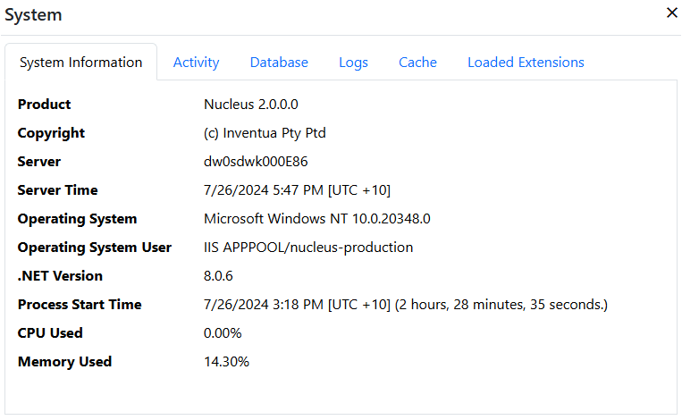

## System Control Panel
The System control panel displays environment and status information for Nucleus.

### System Information
The System Information tab displays information about the web server which Nucleus is running on.  

> If you are running Nucleus on multiple web servers (load balanced or similar), the information shown is from the server which receives 
the HTTP request which populates the data, so it can vary.  

## Activity
The activity tab displays current application activity, including the number of online users and information on currently running scheduled tasks.

> The online users display counts the number of users who have refreshed a page in the last 5 minutes. 

## Database 
The database tab displays your configured database connection information, along with database provider-specific data on the database, like the
server version and database size.  User ID and password values are replaced with '*' characters.

## Logs
If you have configured the text file logger, you can view logs by selecting a log from the drop-down list in the 
==Logs== tab.  

## Cache
The Cache tab displays a list of caches with their usage and capacity. This information can be used to optimize your caching settings.

## Loaded Extensions
The Loaded Extensions tab displays a list of loaded extensions, their assemblies and versions and can be used for troubleshooting and verification purposes.