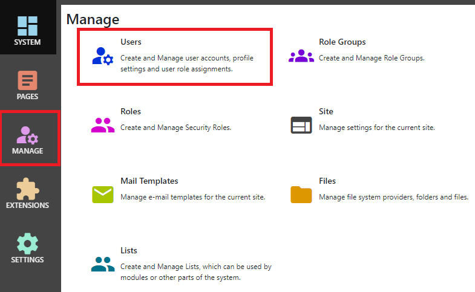
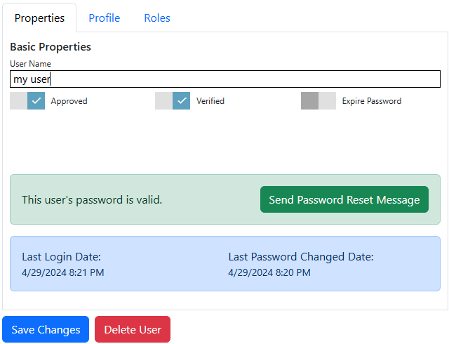

## Users
After logging in as a system administrator or site administrator, you can manage users by clicking the `Manage` button to display the Manage 
control panel, then click `Users`.

## Properties

{.table-25-75}
|                  |                                                                                      |
|------------------|--------------------------------------------------------------------------------------|
| User Name        | All users have a user name.  This is used to log in to the site.  |
| Approved         | Users must be approved in order to log in to the site.   |
| Verified         | If your site is configured to require email address verification, an email is sent to the user after signup with a link to verify their email and account. Until this is done, the user is not verified can can not log in.  |
| Expire Password  | Sets the "expire password" flag, which forces the user to change their password the next time that they log in. |

> A password is not mandatory.  A user without a password will not be able to log in using the standard login module, but could potentially 
log in using an Authenticator App, SAML, OAuth or OpenID Connect provider or another identity provider.

> Administrators can not view or set a user's password.  They can send a password reset email to the user
so that the user can select their own password.

### Information Panels
The user editor displays information on whether the user has a valid password, has been verified and their last 
login and password change dates, along with controls to send password reset and verification messages.

## Profile
Set a user's profile values in the `Profile` tab.  The available user profile properties are configurable in the Site Settings page.

## Roles
Assign a user to one or more roles in the roles tab.  Pages, Modules, Folders and other entities set permissions which are assigned to roles, so users 
have permissions because they are assigned to a role.
