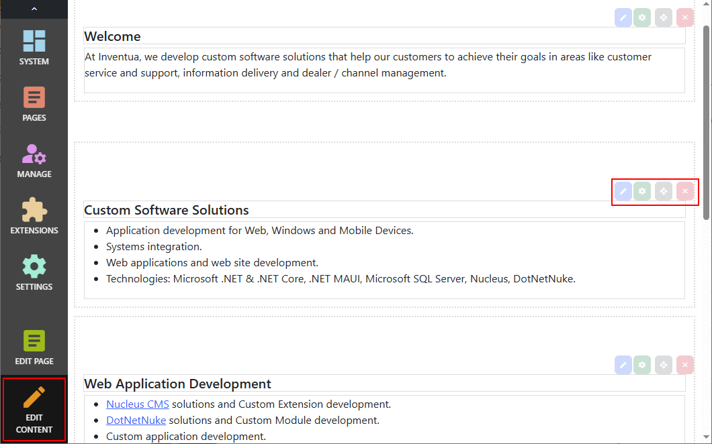

## Editing Content
You can edit your content or module settings by clicking the `Edit Content` button at the bottom-left of the page.  This will enable editing mode, which will 
display a border around each module, and will enable editing controls.

When editing mode is on, you can hover your mouse pointer over a module to see the editing controls.  You can edit content, edit settings or delete a module.  You 
can also edit content using the `Edit Page Settings` button or by clicking `Pages` , navigating to your page and choosing the `Modules` tab.  Use the page settings 
page to add new modules.

> You can also edit module settings (content) in the `Pages` control panel - choose the `Modules` tab and click the edit button there.