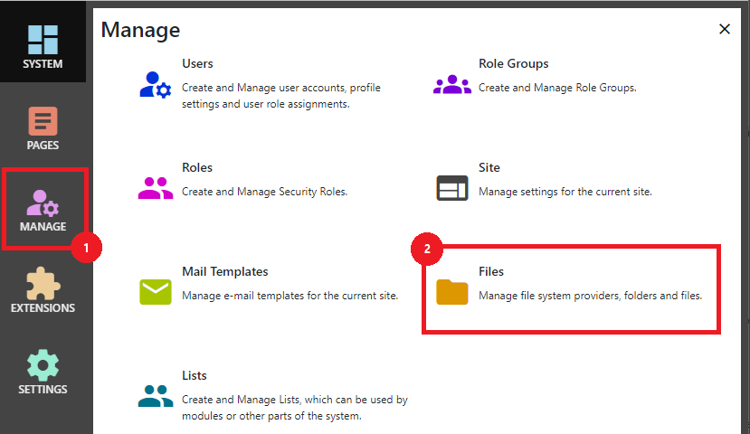
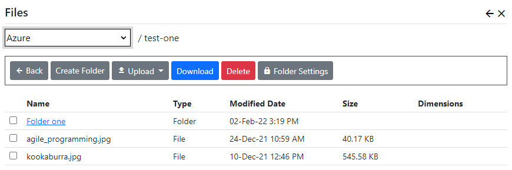

# Files and Folders
You can manage images, documents, videos and other web content from within Nucleus.  Some modules have controls 
which allow you to upload files, but you will perform most file management activities using the File Manager.  After
logging in as a system administrator or site administrator, you can access the file manager by clicking the
`Manage` button to display the Management control panel, then click `Files`.

Nucleus has support for the local file system as well as files hosted in Azure blob storage.  The file provider system is
extensible, so you may have support for other file systems.  You can configure Nucleus with more than one file system.

The file manager displays a drop-down list to select which file provider to manage.  A list of files and folders is listed 
in the main display.

## Selecting a folder
Navigate to a folder by clicking its link in the display.  Navigate back a level by clicking the `Back` button.

## Create a folder
Click `Create Folder` and enter your new folder name to create a folder.  File system providers have different restrictions on
which characters you can use.  If you use invalid characters, you will get an error message.

## Upload a file
Click the `Upload File` button to upload a file.  Some file system providers (like Azure Storage) do not allow you to upload 
files to the root folder.  If you can't see the upload button, choose a sub-folder and upload there.

> **_NOTE:_**  For security reasons, Nucleus restricts the file types that you can use.  You can't upload files
with an extension that is not in the "allowed" list.  File contents are validated against a list of known "signatures", 
so your file content must match its extension.  If you use external file management tools to copy a file with a restricted a 
file extension to your file system, Nucleus will not display the file.  Your system administrator can modify the 
configuration files which control which file types are allowed.

## Rename a file or folder
Some file systems do not support rename operations (most cloud file systems).  If your file system provider supports it, use the 
check boxes on the left to select a single files or folder and click `Rename`.  You will prompted for the new name.

> **_NOTE:_**  You can't change the file extension of a file when renaming it.  This is a security measure to prevent users 
from circumventing restricted file type checking during upload.

## Delete a file or folder
To delete files or folders, use the check boxes on the left to select the files and folders that you want to delete, and click 
`Delete`.  Folders must be empty before you can delete them.

## Setting Permissions
Permissions are set at the folder level.  If your files are intended for use by all of your site users, you will want to grant 
`View` permissions to `All Users`.  Newly-created folders have no permissions by default.

