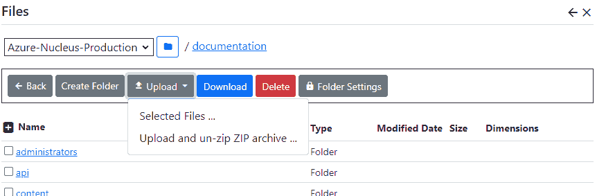

# Files and Folders
You can manage images, documents, videos and other web content from within Nucleus.  Some modules have controls 
which allow you to upload files, but you will perform most file management activities using the File Manager.  After
logging in as a system administrator or site administrator, you can access the file manager by clicking the
`Manage` button to display the Management control panel, then click `Files`.

Nucleus has support for the local file system as well as files hosted in [Azure blob storage](https://azure.microsoft.com/en-au/services/storage/blobs/).  The file provider system is
extensible, so you may have support for other file systems.  You can configure Nucleus with more than one file system.

The file manager displays a drop-down list to select which file system provider to manage.  A list of files and folders is listed 
in the main display.

## Create a folder
Click `Create Folder` and enter your new folder name to create a folder.  The file manager automatically 
navigates to your new folder after creating it.

> File system providers have different restrictions on which characters you can use.  If you use invalid characters, you will get 
an error message.  

## Selecting a folder
Navigate to a folder by clicking its link in the display.  Navigate back a level by clicking the `Back` button.

## Upload a file
Click the `Upload File` button to upload a file.  Some file system providers (like [Azure Blob Storage](https://azure.microsoft.com/en-au/services/storage/blobs/)) 
do not allow you to upload files to the root folder.  If the upload button is disabled, you will need to create a sub-folder and 
upload your files there.  The `Upload` button displays a menu - you can choose to upload a single file, or you can upload a zip file 
to be un-zipped into the current folder.

> For security reasons, Nucleus restricts the file types that you can use.  You can't upload files with an extension that 
is not in the "allowed" list.  File contents are validated against a list of known "signatures", so your file content must match
its extension.  This applies to single file uploads, and to the files within a zip, if you have chosen the upload option which un-zips 
the zip file contents automatically (if any files in the zip are invalid, they are skipped, and the rest of the files are un-zipped).  If 
you use external file management tools to copy a file with a restricted file extension to your file system, Nucleus will not display the 
file.  If you need to support file types that aren't in the default approved list, your system administrator can modify the Nucleus 
[configuration files](/configuration-files/) which control which file types are allowed.  

> The default allowed file extensions are web documents (css, htm, html), 
images (ico, jpg and jpeg, gif, png, bmp, webp, tif and tiff), Microsoft Office documents (doc, docx, pptx, ppt, xls, xlsx, vsd),
video and audio (mp4, mpg, mpeg, webm, mkv, mka), common document formats (rtf, xps, pdf), plain-text (txt, md, xml) and zip files.  System
administrators can add or remove allowed file types in the Nucleus application [configuration files](/configuration-reference/).

## Rename a file or folder
Some file systems do not support rename operations (most cloud file systems including Amazon S3 and Azure do not support rename operations).  
If your file system provider supports it, use the check boxes on the left to select a single file or folder and click `Rename`.  You will 
prompted for the new name.

> You can't change the file extension of a file when renaming it.  This is a security measure to prevent users 
from circumventing restricted file type checking during upload.

## Delete a file or folder
To delete files or folders, use the check boxes on the left to select the files and folders that you want to delete, and click 
`Delete`.  Folders must be empty before you can delete them.

## Setting Permissions
Permissions are set at the folder level.  If the files within a folder are intended for use by users of your site, you will want to grant 
`View` permissions to `All Users`.  Newly-created folders have no permissions by default.

