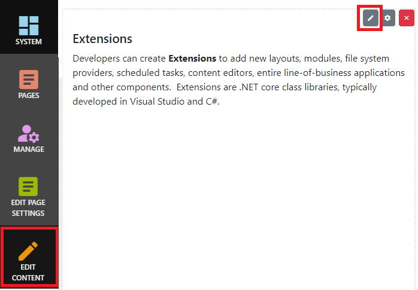
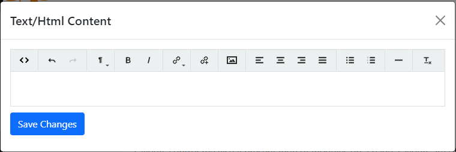

## Text/HTML module
The Text/HTML module renders HTML or text content.  You can edit your content by clicking the `Edit Content` button at the bottom-left of the page

The editor is similar to other rich text editors.  You can set formatting, bold/italic, insert links to other web sites, page links and image 
links, and add lists.  If you need to edit Html content directly, click the `<>` button.

