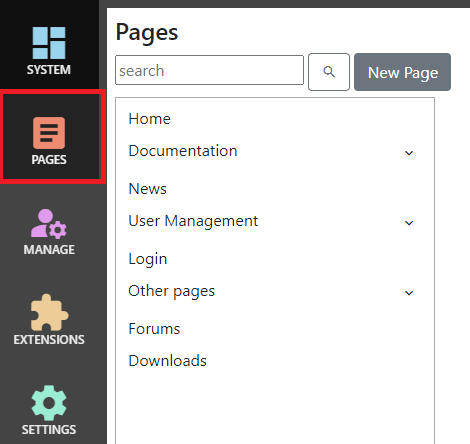
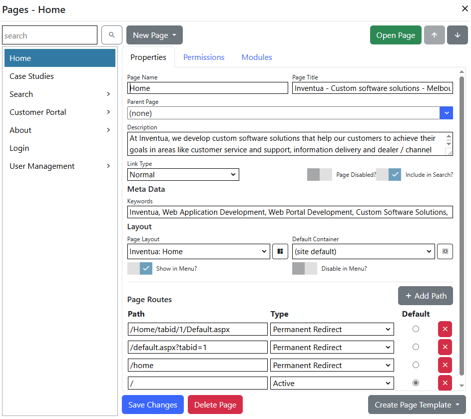

# Page Management
After logging in as a system administrator or site administrator, you can access the page manager by clicking the
`Pages` button, or you can edit the current page settings by clicking the `Edit Page Settings` button.

To create a new page, click the `New Page` button.  To edit an existing page, select it from the menu on the left.  Click the arrow icon to 
the right of any page which contains child pages to open a list of child pages.  You can also 
search for pages by typing part of the page name, title, description or keywords.  Search results are displayed 
automatically while you type.

## Basic Properties

{.table-25-75}
|                  |                                                                                      |
|------------------|--------------------------------------------------------------------------------------|
| Page Name        | The page name is displayed in control panel menus, in menus and by the site map.  |
| Page Title       | Title of the page.  The page title is displayed in some browser page/tab captions, is displayed as the heading for search results, and is important for search engine optimisation.  |
| Parent Page      | Pages can be organized in a heirachical structure.  This structure is used by control panel menus, in menus and by the site map but has no effect on the page Url. |
| Description      | Description of the page.  Some search engines use the page description to generate result snippets. |
| Page Disabled    | Specifies whether the page is available.  Disabled pages are not displayed in menus, and navigating to a disabled page will generate a '404: Not found' response. |
| Link Type        | You can create pages which redirect to another page, a file or external Url using the Link Type control. |

## Meta Data/SEO

{.table-25-75}
|                  |                                                                                      |
|------------------|--------------------------------------------------------------------------------------|
| Keywords         | Enter page keywords separated by commas.  Keywords may be used by a built-in search indexing service.  They are not used by search engines like Google, and are not rendered within the page meta-data. |

## Layout

{.table-25-75}
|                  |                                                                                      |
|------------------|--------------------------------------------------------------------------------------|
| Layout           | Select a page layout for this page, or select '(default)' to use the default layout for this site. |
| Default Container| Select a default container for modules on this page, or select '(default)' to use the default layout for this site. |
| Show in Menu     | Specifies whether the page is displayed in menus. |
| Disable in Menu  | If the page is being used as a placeholder (heading) in menus, and has no content, set 'Disable in menu' to prevent it from being clickable in menus. |

## Paths
Page paths are the Url for your page.  Each page must have at least one path in order to be accessible by users.  

{.table-25-75}
|                  |                                                                                      |
|------------------|--------------------------------------------------------------------------------------|
| Path             | The url path for the page.  Paths start with a `/` character, which is automatically added if it is missing. |
| Type             | Active paths will respond normally when requested.  Permanent Redirect paths will respond with a 301: Moved Permanently response, which will redirect to the default path for the page. |
| Default          | Specifies the default path for the page.  A page can have only one default path.  If none are specified, the first path is treated as the default.   |

> **_AVOID:_**  spaces in paths.  Browsers will replace spaces with %20% - which works, but doesn't look good in the browser address bar.  Instead, use a '-' or another character for word breaks.  You should
also avoid non-alphanumeric characters, apart from '-' because most of these will be url-encoded as well.

> **_TIP:_**  You can use `Permanent Redirect` paths to maintain compatibility with old versions of your site.

## Permissions
Click the `Permissions` tab to view and modify permissions for the page.  You can add roles for the page, and specify whether users within those roles have view or edit permissions.  Administrator 
users always have view and edit permissions.  The `All Users` role is restricted, and can only have view permission.

## Modules
The modules tab is not available for new tabs until you save.  Use the modules tab to add modules to the page.  Once a module has been added, you can edit its settings, move it up and down within its 
pane, and delete it if it is no longer required.

### Module Settings

{.table-25-75}
|                  |                                                                                      |
|------------------|--------------------------------------------------------------------------------------|
| Module Type      | You can choose any of the installed modules to add.  After a module has been added, you can't change its type. |
| Title            | The module title is displayed on-screen, unless you choose a container which does not display the title.    |
| Pane             | Specifies the pane to display the module in.  Different layouts have different available panes and pane names.   |
| Container        | Specifies the container for the module, or select '(default)' to use the default layout for this page.   |
| Style Classes    | Use style classes to add a CSS class to the wrapper for the module.  Most of the time, containers should be used to apply different visual styles, but you can use style classes to apply bootstrap CSS styles, or styles which may be available from your layout or container. |

> **_TIP:_**  It's a good idea to specify a title, so that you know what the module is for, even if you don't want it shown on-screen.  Choose (or create) a container that doesn't 
display the title if you don't want to display it.

## Module Permissions
Use the `Permissions` tab to set permissions for a specific module, or use the default `Inherit from Page` option.
