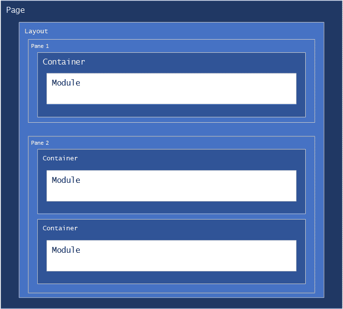

Layouts and containers control the visual presentation of modules on a page.  Each layout contains one or more `panes`, which can contain module
instances.  Each module can have a container, which is rendered as a wrapper to the module content.



### Layouts
Layouts control the visual presentation of modules on a page.  Layouts are often called "Themes" or "Skins" in other content management systems.  Layouts 
are partial Razor pages which define sections of the page (`Panes`) using HTML, and use `@await Html.RenderPaneAsync("PANE-NAME")`
to render modules which have been assigned to a pane.  An associated CSS file is used to style the page and panes.

> **_Tip:_**  You can name your panes anything you want, but keep in mind that your pane names are how your users identify which area of the page that they
are adding modules to, so try to make them easy to understand within in the context of your layout.

#### Sample Layout
This is a sample of a three row layout, with a top banner, a middle content pane and a fixed height bottom pane.  This layout uses the `Logo` Tag Helper
to render the site logo, the `Account` Tag helper to provide login/logout and account controls, the `menu` Tag helper to draw a menu, the `Breadcrumb`
Html Helper to draw a breadcumb trail to show the user's location within your site, and the `Terms` Tag Helper to show your site's terms of use.  

Also note the use of the Bootstrap classes `navbar ms-auto flex-row justify-content-end` for the `account` tag.  You don't have to use them, but 
'Bootstrap classes are always available in Nucleus.

Most Nucleus view feature extensions that are indended for use in layouts are provided as both Tag Helpers and Html Helpers, so you can use whichever you 
prefer.

{.file-name}
`your-layout.cshtml`
```
@addTagHelper "*, Nucleus.ViewFeatures"
@using Nucleus.ViewFeatures.HtmlHelpers
@using Nucleus.ViewFeatures
@using Nucleus.Extensions

@*
  Use the AddStyle Html helper to add stylesheet (CSS) files required by your layout.  The AddStyle Html 
  helper can resolve the Url to your stylesheet, and ensures that no duplicate links to stylesheets are 
  rendered. The AddStyle Html helper parses the leading ~! characters and renders an Url which is relative 
  the currently executing view path (the folder which contains your layout .cshtml file).
*@
@Html.AddStyle("~!/your-layout.css")

<div class="LayoutWrapper">
  <div class="BannerPane">
    <div class="d-flex">
      @*  
        The Logo tag helper displays the logo image which is set in the site settings control panel, wrapped by a
        link to your home page.  If no logo image is configured, nothing is rendered.  You can optionally include 
        a caption attribute to override the title attribute which is set on the image element, otherwise 
        the title is set to the site's name.  A Logo Html Helper is also available, with the same functionality.
      *@
      <Logo />

      @*  
        The Account tag helper displays the logged-on user name, or if the user is not logged on, a button 
        which navigates to to the site's login page. If the user is logged in, a drop-down menu with links 
        to the account settings, change password and logout functions is displayed.  
        An account Html Helper is also available, with the same functionality.
      *@
      <account class="AccountControl navbar ms-auto flex-row justify-content-end"></account>
    </div>

    @*  
      The menu tag helper displays a site menu.  You can set the maximum number of levels and menu style.  
      Available menu styles are DropDown, RibbonLandscape and RibbonPortrait.
      A menu Html Helper is also available, with the same functionality.
    *@
    <menu maxLevels="3" menuStyle="RibbonPortrait"></menu>

    @*
      The breadcrumb Html helper renders a breadcrumb control showing the path to the current page.  You can 
      use the hideTopLevel parameter to suppress display of the top-level page, and you can include html 
      attributes.  You can also use the simple form - @Html.Breadcrumb() with no parameters.
    *@
    @Html.Breadcrumb(false, new { @class = "my-breadcrumbs" })
    @await Html.RenderPaneAsync("BannerPane")
  </div>

  <div class="ContentWrapper">
    <div class="ContentPane">
      @await Html.RenderPaneAsync("ContentPane")
    </div>
  </div>

  <div class="BottomPane">
    <terms caption="Terms" />
    @await Html.RenderPaneAsync("BottomPane")
  </div>
</div>
```

{.file-name}
`your-layout.css`
```
.LayoutWrapper { display: flex;  flex-direction: column;  height: 100%; }
.BannerPane { display: flex; flex-direction: column; }
.BannerPane .Breadcrumbs { margin-left: 4px; vertical-align: middle; }
.BannerPane .AccountControl { margin-right: 2px; gap: 2px; }
.BannerPane .AccountControl .dropdown-menu { left: auto; margin: auto; }
.BannerPane .AccountControl > * { flex-grow: 0; }
.ContentWrapper { flex-grow: 1; display: flex; overflow: auto; flex-direction: row; }
.ContentPane { display: flex; flex-direction: column;  flex-grow: 1; }
.ContentPane > div { display: flex; flex-direction: column; }
.BottomPane { display: flex; flex-direction: column; background-color: #535353;  padding: 0.5rem; }
.BottomPane * { color: white; }
```

> **_Note:_**  A Nucleus layout is a Razor view which renders partial HTML - it does not contain `<html>` or `<body>` tags.  Nucleus renders a full HTML 
page including all required elements "around" your layout.

> **_Tip:_**  Use `@Html.AddStyle` to add your CSS stylesheets.  Nucleus automatically detects duplicate CSS stylesheets, and renders `<link>` tags with the appropriate attributes.  Use
the special characters `~!` to represent the path of your layout (cshtml file) - the example above is referencing a default.css file in the same location as the layout.  The AddStyle function is
provided by the `Nucleus.ViewFeatures` namespace.  If you need to add links to javascript files, use `@Html.AddScript`.  You can also use the characters `~#` to represent the root 
path for your extension.

### Containers
Containers control the visual presentation of specific modules that they are assigned to.  Containers are "wrapped" around a module in a layout pane.

#### Sample Container
The simplest form of a container is one which simply renders `@Model.Content`, but your container will generally include other Html elements, as 
well as CSS styles to control prenentation.  You can also access the properties of the container **Model**, which is of type 
[Nucleus.Abstractions.Layout.ContainerContext](/api-documentation/Nucleus.Abstractions.xml/Nucleus.Abstractions.Layout.ContainerContext/) to 
access the [Site](/api-documentation/Nucleus.Abstractions.xml/Nucleus.Abstractions.Models.Site/), 
[Page](/api-documentation/Nucleus.Abstractions.xml/Nucleus.Abstractions.Models.Page/) and 
[Module](/api-documentation/Nucleus.Abstractions.xml/Nucleus.Abstractions.Models.PageModule/) properties.  The example below uses 
the [`Model.Module.Title`](/api-documentation/Nucleus.Abstractions.xml/Nucleus.Abstractions.Models.PageModule/#Title) property to output the 
module's title as a heading.

{.file-name}
`your-container.cshtml`
```
@model Nucleus.Abstractions.Layout.ContainerContext
@Html.AddStyle("~!/your-container.css")
<div class="layout-yourcontainer">
  @if (!String.IsNullOrEmpty(Model.Module.Title))
  {
    <h2>@Model.Module.Title</h2>
  }
  @Model.Content
</div>
```

{.file-name}
`your-container.css`
```
.container-default { padding: 4px; display: flex; flex-direction: column; overflow: auto; }
```

> **_Tip:_**  The example layout and container above use different CSS stylesheets for the layout and container, but it's a good idea to merge small CSS files together and share them between 
your layouts and associated containers, if they are designed to work together, because it reduces the number of HTTP requests that are required to load a page.  


