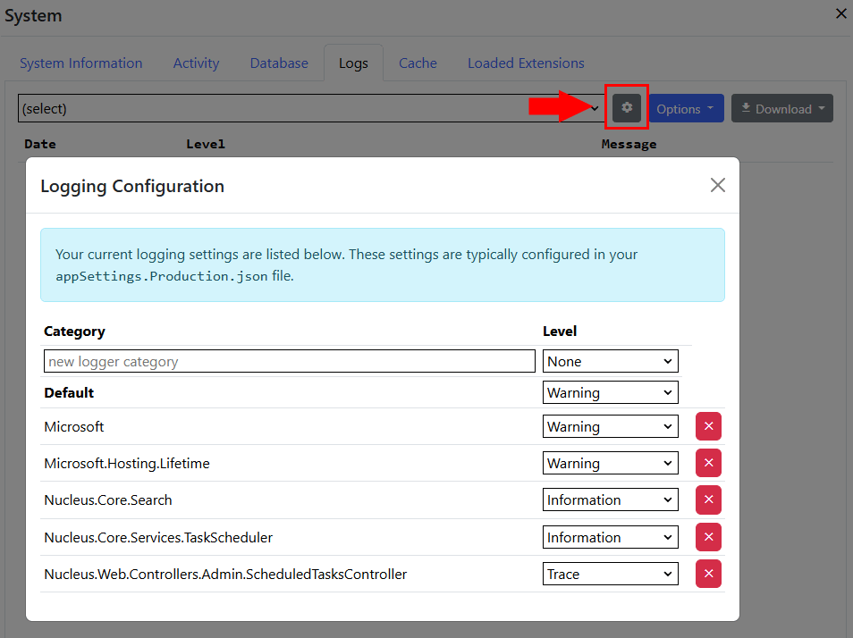

Scheduled tasks perform their work periodically and are generally used to perform system maintenance, like expiring cache entries, updating a search 
index, or sending notification e-mails. 

To create a new scheduled task, create a class which inherits 
[Nucleus.Abstractions.IScheduledTask](/api-documentation/Nucleus.Abstractions.xml/Nucleus.Abstractions.IScheduledTask/#mnu-Nucleus-Abstractions-IScheduledTask).  Nucleus 
automatically detects implementations of [IScheduledTask](/api-documentation/Nucleus.Abstractions.xml/Nucleus.Abstractions.IScheduledTask/#mnu-Nucleus-Abstractions-IScheduledTask) 
and adds them to the dependency injection container during startup, so that the task scheduler can create instances and execute them.  The site administrator must 
create a scheduled task entry in the Settings/Scheduler control panel so that your scheduled task runs.

As with other .NET core classes which participate in dependency injection, you should add parameters to your constructor to get references to services from the
dependency injection container that your scheduled task requires.

You should include a [DisplayName](https://docs.microsoft.com/en-us/dotnet/api/system.componentmodel.displaynameattribute) attribute on your 
scheduled task class in order to display a friendly name in the Nucleus control panel.  The convention for friendly names is 
extension-name: task-name.  For example: ==Forums: Send Notification Emails==.

#### Sample Scheduled Task
```
using System;
using System.Threading;
using System.Threading.Tasks;
using Nucleus.Abstractions;
using Nucleus.Abstractions.Models.TaskScheduler;
using System.ComponentModel;

[DisplayName("My Scheduled Task")]
public class MyScheduledTask : IScheduledTask
{
  private IMyExtensionManager MyExtensionManager { get; }
  private  ILogger<MyScheduledTask> Logger { get; }

  public MyScheduledTask(IMyExtensionManager myExtensionManager, ILogger<MyScheduledTask> logger)
  {
    this.MyExtensionManager = myExtensionManager;
    this.Logger = logger;
  }

  public Task InvokeAsync(RunningTask task, IProgress<ScheduledTaskProgress> progress, CancellationToken cancellationToken)
  {
    // Don't await the result of your function.
    return DoStuffAsync(progress);     
    // Or, for a non-async function, use Task.Run():
    // return Task.Run(()=> DoStuff(progress));
  }
    
  private async Task DoStuff(IProgress<ScheduledTaskProgress> progress)
  {
    this.Logger.LogInformation("My scheduled task has started");
    var count = this.MyExtensionManager.DoSomething();
    this.Logger.LogInformation("{count} items were updated.", count);
    progress.Report(new ScheduledTaskProgress() { Status = ScheduledTaskProgress.State.Succeeded });
  }

  private async Task DoStuffAsync(IProgress<ScheduledTaskProgress> progress)
  {
    this.Logger.LogInformation("My scheduled task has started");
    var count = await this.MyExtensionManager.DoSomething();
    this.Logger.LogInformation("{count} items were updated.", count);
    progress.Report(new ScheduledTaskProgress() { Status = ScheduledTaskProgress.State.Succeeded });
  }
}
```

Scheduled Tasks implement the [InvokeAsync](/api-documentation/Nucleus.Abstractions.xml/Nucleus.Abstractions.IScheduledTask/#InvokeAsync(RunningTaskIProgressScheduledTaskProgressCancellationToken)) 
method to perform their work.  Your implementation of [InvokeAsync](/api-documentation/Nucleus.Abstractions.xml/Nucleus.Abstractions.IScheduledTask/#InvokeAsync(RunningTaskIProgressScheduledTaskProgressCancellationToken)) 
should execute asynchronously (either return a Task object, or if your implementation doesn't use async methods, use Task.Run to call a 
function then return immediately) so that scheduled tasks can run in parallel.  Use the progress object to report progress (as 
a percent) if you have a long-running task, and to report success or failure by calling 
[progress.Report](https://docs.microsoft.com/en-us/dotnet/api/system.iprogress-1.report). Use
the .Net core [ILogger](https://docs.microsoft.com/en-us/dotnet/api/microsoft.extensions.logging.ilogger) to report information, warnings 
or errors.

> If your scheduled task uses logging and your site is configured to use the Nucleus Text File Logger (which is the default), the text file logger automatically detects 
log entries which originate from a scheduled task and writes log output to a file system path which is specific to your scheduled task, 
`[LogFolder]\Scheduled Tasks\[schedule-name]`.  Log output from scheduled tasks is also written to the main Nucleus log. 
Site administrators can review scheduled task logs in isolation from the rest of the system logs by viewing the log file directly, or by 
using the ==Logs== tab in the [Scheduled Tasks Manager](/manage/task-scheduler/).  

If required, use `appSettings.json` or `appSettings.{environment}.json` to configure different log levels for specific classes by adding a line to the 
`Logging/LogLevel` section. Your configuration file will normally already have a Logging:LogLevel section, you should add new entries to the 
existing section.

Example: 
```
{
  "Logging": {
    "LogLevel": {
      "Default": "Warning",
      "Nucleus.Core.Search.PageMetaDataProducer": "Information"
    }
  ...
}
```

You can also update logging settings in the `System` Control Panel, in the Logs tab.




> **_NOTE:_**   Nucleus automatically detects scheduled tasks in installed assemblies, so you don't need to add anything special to your
extension manifest (other than including the assembly which contains your class), or any lines of code in your [startup](https://www.nucleus-cms.com/developers/startup-classes/)
class.  Nucleus does not automatically configure a schedule for installed scheduled Tasks - your users must use the 
[Scheduled Tasks Manager](/manage/task-scheduler/) to create a schedule.


