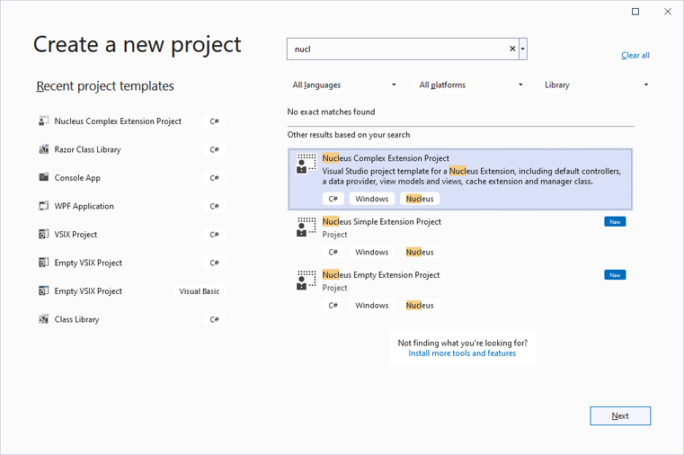
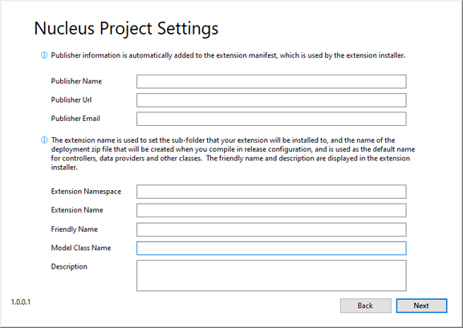

## Walkthough - Developing a Nucleus Module

> This walkthrough assumes that you have installed the Nucleus developer tools from the [Downloads](/downloads/) page.

### Step 1: Create a Project
Create a new project in Visual Studio 2022.  In the ==Create a new project== Visual Studio dialog, search for "nucleus" to find the Nucleus project
templates. If you are creating an extension which writes data to module-specific database tables, select the ==Nucleus Complex Extension Project==
project template, which includes controllers, a data provider, view models, views and a manager class.  If you are developing a simple module or 
other extension which uses built-in Nucleus tables to store module settings, use the ==Nucleus Simple Extension Project== template, which does 
not include data provider and manager classes.

### Step 2. Configure your Project
Enter your project name and the location for your source code files and click ==Create==.

### Step 3. Enter Nucleus project settings.  
Your publisher information and the extension friendly name and description are automatically included in the manifest (package.xml) file, and 
are displayed during installation and in the extensions control panel.  You can change this information later by editing package.xml.

|                     |                                                                                      |
|---------------------|--------------------------------------------------------------------------------------|
| Extension Namespace | The root namespace for classes in your generated code.  |
| Extension Name      | The extension name is used as the folder name (in /extensions) for your installed extension, and is also used by MVC routing, so it is a good idea to make sure that it doesn't contain spaces, or any characters which can't be used by file systems or in Urls.  |
| Friendly Name       | The friendly name is displayed when installing your extension, and in the Extensions control panel after your module is installed. |
| Model Class Name    | Class name used when generating code for the default model class, and in other classes which reference it.  |
| Description         | The description is displayed when installing your extension, and in the Extensions control panel after your module is installed. |

Click Next.  Your project is automatically generated and you are ready to start developing.

### Step 4: Develop your Module
The templates reference version 1 of the Nucleus Nuget packages. You should use the "Manage Nuget Packages" menu item in Visual Studio to update to the latest version.

1.  Create your database objects\
Navigate to `DataProviders/Migrations/Scripts`, and edit the `01.00.00.json` script.  Migration scripts are in .json format, and are a (mostly) 
database agnostic way to define your database objects.  The Nucleus project template generates a commented-out example which you can modify to create your database table(s). The 
main database table for most module will include an ==Id== column to serve as a unique key for each record, a ==Module Id== column to link your data to a module instance, and 
==DateAdded==, ==AddedBy==, ==DateChanged== and ==ChangedBy== columns to provide simple tracking of changes to data.  The other columns will be specific to your module. If your module 
doesn't need its own database tables, you can use the ==Nucleus Simple Extension Project== template, or you can just delete the `DataProviders` folder.

2.  Create your Models\
Open the Models folder, and modify the model which was generated by the template.  Add properties to represent the columns in your database table.  The template model inherits 
`Nucleus.Abstractions.Models.ModelBase`, so you do not need to add ==DateAdded==, ==AddedBy==, ==DateChanged== and ==ChangedBy== columns because they are provided by `ModelBase`.

3.  Create your DbContext class\
Review the DbContext class, and add code to the `OnModelCreating` function to tell Entity-Framework about your database objects.

4.  Create your DataProvider class\
The template generates an interface and an implementation of the interface in the `DataProviders` folder. Add the methods your module needs to access data.

5.  Create your Settings Model\
If your module will have configuration settings, add properties to `Models\Settings.cs` to represent the settings, and add lines of code to the ReadSettings function to 
populate them from the ModuleSettings class.

6.  Create your CacheExtension class\
The CacheExtension class provides an interface to the Nucleus data caching system.  If your module only has a single Model class, the auto-generated class should work as-is.  If 
you have more than one model class that can benefit from data caching, add additional static methods to represent each one.  If you are not implementing data caching, you can remove the 
CacheExtension class.

7.  Create your Manager class\
In the pattern which is generated by the template, controllers do not directly call your data provider, they call the manager class.  The manager class calls your data provider, 
and is called by your controllers.  It can handle data caching, validation and may perform additional processing.  Implement methods in your manager class that your module needs 
to access data.  The template includes code which wraps calls to the `.Get` Data Provider method in a call to the data caching system.  If you are not implementing data caching, you 
can remove the lines of code which call the Nucleus Cache Manager.

8.  Create your Admin controller\
The template generates a separate controller class for Admin functions.  Modules with straightforward settings will implement a Settings action to read settings into a view model for 
on-screen display, and a SaveSettings action to save changes to settings to the database.  The auto-generated code will work as-is, you will just need to add lines of code to the 
SaveSettings method to store any additional settings.  Simple settings can be saved to the module's `ModuleSettings` collection.  More complex settings may use your ==Manager== class to 
store data in your module's database tables.

9.  Create your Viewer controller\
The template generates a separate controller class for View functions, used when displaying the module content to end users.  The auto-generated code will work as-is to read module 
settings from the `ModuleSettings` collection, but more complex settings may use your ==Manager== class to read data from your module's database tables.

10.  Create your Settings View\
The settings view is displayed in the Nucleus administration user interface.  It will display the current settings and will contain a button to save updates to settings.  

11.  Create your Viewer View\
The Viewer view is displayed to end users.  The content if the Viewer view is dependant on what your module does!

12.  Review package.xml
Add `<folder>` and `<file>` entries for any views or static resources (css, images) that you have added.  If your project includes a readme 
and/or license file, add `<file>` entries at the root level for them.  Files named `readme.txt, readme.md, readme, readme.htm, license.txt, 
license.md, license` or `license.htm` are automatically displayed to end users during installation.

13.  Build your module in release mode
The Nucleus build script automatically packages your files into an installation (zip) package, located in the same folder as your project (`.csproj`) file.

14.  Run Nucleus and install your module
Refer to [Installing Extensions](/manage/install-extensions/) for help on installing a module.

> In ==Release== configuration, the Nucleus build script creates an installation package.  In ==Debug== configuration, the Nucleus build 
script copies the package files to `%NUCLEUS_PATH%\Extensions\{extension-name}\`.  When debugging, you will need to install a release build 
first, so that any required database entries are created but after the first installation you can generally just do a debug build to update 
the files in your Nucleus test instance.  

> You can debug by downloading and running the Nucleus source code from [GitHub](https://github.com/Inventua/nucleus-core/tree/main/Nucleus.Web)
in Visual Studio, or if you are running a compiled version, you can use the ==Debug/Attach to Process== function in Visual Studio to attach to 
a running instance.  If you run `Nucleus.Web.exe` directly, you can attach to the process named `Nucleus.Web.exe`.  If you are running from
Internet Information Services, you will attach to `w3wp.exe`.

> %NUCLEUS_PATH% is automatically set to the location of the Nucleus build tools the first time you create a project, but your Nucleus test 
instance won't be located there, so once you have installed a test instance on your local machine, you will need to edit the `NUCLEUS_PATH` 
environment variable and point it at your test instance.  You will also need to copy `module.build.targets` from 
[GitHub](https://github.com/Inventua/nucleus-core/tree/main/Nucleus.Web) to your new %NUCLEUS_PATH%.
