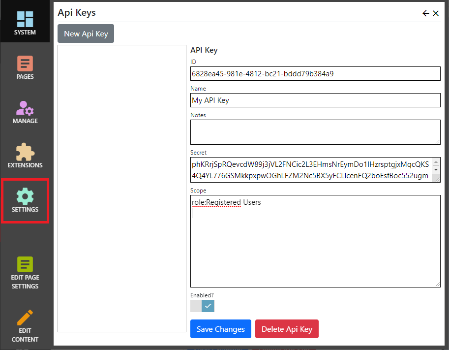

## Api Keys
To manage Api Keys, click "Settings", then choose "Api Keys".

Api Keys are used to manage access keys and shared secrets used to authenticate inbound requests when applications (rather than users) access 
Nucleus endpoints.  The search feeder uses an Api Key to authenticate when retrieving page content for the search index, and other Nucleus extensions 
can use Api Keys to authenticate applications which use their functionality.

## Properties
|                                  |                                                                                      |
|----------------------------------|--------------------------------------------------------------------------------------|
| ID                               | The Api Key ID is the "access key" |
| Name                             | The name for the Api Key, used for your reference only.  |
| Notes                            | Your notes for the Api Key.  You can add information on who the key was assigned to, it's intended use and any other information that you require.  Notes are displayed in the Api Key editor only.  |
| Secret                           | The secret is an auto-generated string, which is shared with the user of an Api Key, and is used to create an Authentication token.  |
| Scope                            | One of more scopes, separated by line feeds.  Scopes specify the access rights for the Api Key.  Extensions can implement their own scope checking, and Nucleus automatically recognizes scopes in the form `role:role-name`.  |
| Enabled                          | Specifies whether the Api Key is enabled.  |

### Making a request using an Api Key
Applications which make Http requests to Nucleus must specify an Authorization header, with a "scheme" of `Nucleus-HMAC256` and a value which is generated using 
values from the request and the shared secret.  The `Nucleus.Extensions.HttpRequestExtensions` contains a `.Sign` method which will add the header to a Http Request 
object.  Applications which do not want to reference the `Nucleus.Extensions` assembly can copy the [source code](https://github.com/Inventua/nucleus-core/blob/main/Nucleus.Extensions/HttpRequestExtensions.cs) into their project.