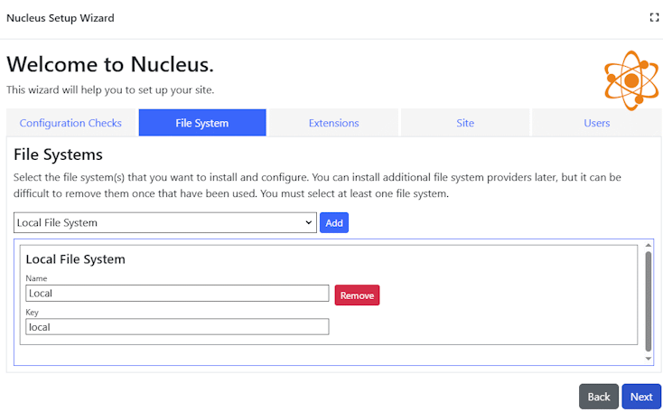

# Installing Nucleus
Nucleus can be used with different hosting environments, database providers and file system providers. 

|                           |                     |                                               |
|---------------------------|---------------------|-----------------------------------------------|
| Hosting Environments      | Windows, Azure App Service, Linux     |
| Databases                 | Sql Server (including Azure SQL), Sqlite, PostgreSQL, MySql/MariaDb | 
| File Systems              | Local file system, Azure Blob Storage, Amazon S3                    |

## Basic Setup 

1. Download the install set (zip format) from the [downloads](/downloads) page.  For a new installation, you will need to download the 
Nucleus.[version].Install-[platform].zip file.
   > There are platform-specific install sets for Windows x64, Linux x64 and Linux arm64, as well as a **portable** install set which can be used on 
any platform that supports .NET core. The platform-specific install sets are about 60% of the size of the portable sets because they do not 
include runtimes for all possible platforms. 

2. Follow the setup guide for your run-time environment to install prerequisites and Nucleus.
    - [Windows](/manage/hosting/windows/)  
    - [Azure App Service](/manage/hosting/azure-app-service/)  
    - [Linux](/manage/hosting/linux/)

   After you have completed the installation process, proceed to step 3.

3. Open a browser and browse to your Nucleus Url, and use the setup wizard to configure your file system provider(s), database provider, install
default extensions, and create administrator users.

## Setup Wizard

The first time that you run Nucleus, the Setup Wizard will run.

### Database Settings

The first step is to select your database. You can use Microsoft SQL Server (including Azure SQL Database), MySql (including Maria DB), 
Sqlite or PostgreSQL.  

1. First, create an empty database using the management tools for your selected database server, and configure permissions and other 
settings.  If you are using Sqlite, you do not need to create a database, because Sqlite creates your database file automatically.

2. Select your database type.  
   > If you are using Azure SQL Database, choose SQL Server. Azure SQL Database is an SQL Server "Managed Instance" running in Azure.
   If you are using MariaDB, choose MySql. MariaDB is a community-developed, commercially supported fork of MySQL.

   {.text-center}

3. Enter your database server name.
   > If your database administrator has supplied a connection string, or you have a database connection string from a service provider, you 
can skip past the settings and paste your connection string into the "Connection string" text box.

4. Select database-specific connection settings.
   > Different database types have different settings available, and Sqlite doesn't have any settings.  When you use SQL Server, MySql or PostgreSQL, you 
choose whether to use integrated security or user name and password authentication, and Sql Server also has encryption and certificate options. The
values that you should choose depend on how your server is configured.

5. Click ""Refresh"", then select your database name.

6. Click Next. The setup wizard will write your database settings to a configuration file, and restart.
   > If the setup wizard doesn't automatically proceed to the next step for any reason, refresh your browser. 

### Site Template
Select a template from the list and click Next. The template generates a default set of pages, roles and other settings.

{.text-center}

### Configuration Checks
The configuration checks tab runs some configuration checks to ensure that you the correct file access permissions and can connect to the database. Review
the results, fix any problems and click Next.

{.text-center}

### File System
You can configure one or more file systems. This is where your site's content files are stored.

{.text-center}

If you configure more than one file system, the file system management controls in Nucleus will display them in a drop-down list, and you can select 
the file system that you want to work with. You can store different files in differernt file system if you need to.

- Local File System  
  You can use the local file system to store your site's files. By default in Windows, files are stored in 
`C:\ProgramData\Nucleus\Content`. In Linux, the default location is `/home/nucleus/data/Content`. If you want to change where local files are stored, you will 
need to edit your configuration files.  [Configuration Reference - Folder Options](https://www.nucleus-cms.com/configuration-reference/#nucleusfolderoptions).
- Azure Blob Storage  
  After you set up Azure storage in the Microsoft Azure Portal, select your storage service and click ""Access Keys"" in the Security + Networking 
menu.  
[Create an Azure storage account](https://learn.microsoft.com/en-us/azure/storage/common/storage-account-create?tabs=azure-portal).
- Amazon S3  
  For Amazon S3, you need your S3 access key, secret, service Url and root path.

  **Access Key and Secret**: Use the Amazon ""IAM Dashboard"" (identity and access managment) dashboard. Click ""Users"", and create an access key. Make sure to record your 
access key and secret, as the AWS control panel will not allow you to view the secret after you initially create it. 

  **Service Url**: The service Url depends on what region you have set up your S3 service in. It is generally in the form "http://s3.region.amazonaws.com", where "region" 
is the Amazon code for your region.  
[Amazon S3 endpoints list](https://docs.aws.amazon.com/general/latest/gr/s3.html).

  **Root Path**: Use the S3 dashboard to view your ""buckets"". Choose an existing bucket or create a new one. The bucket name is your root path. 

Click Next to continue.

### Extensions
The install set comes with a set of common extensions. Select the extensions that you want to install and click Next.  You can install more extensions later.
> Extensions which are used by your selected site template, or by your selected file systems are automatically selected, and cannot be un-selected.

{.text-center}

### Site
Enter your site settings in the Site tab.

{.text-center}

{.table-25-75}
|                     |                                                                                      |
|---------------------|--------------------------------------------------------------------------------------|
| Site Name           | The name of your site is displayed in administration pages, is also often used in email templates and for on-screen display. You can change your site name in the site editor later. |
| Default Alias (url) | Site aliases are used to identify the correct site when viewing a page. The default alias is used when generating Urls in page output and in system-generated emails. You can add and remove site aliases or change the default alias in the site editor later. |
| Home Directory      | The home directory is a sub-folder within your configured file system root which is used as the top-level folder. By using a home directory, you can use the same local file system folder, Azure Blob Storage service or Amazon S3 bucket for multiple sites (each with its own unique home folder). If you have configured more than one file system provider, this value is used for all of them. This value is difficult to change later. |
| Security Roles      | Nucleus has 4 "system" security roles - a role which you can add users to for Administrator users, and special roles to represent registered users, anonymous user and all users. You can change the names of these roles during setup if required. The system role names can't be changed later. |

Click Next to continue.

### Users
The last step is to specify the user name and password for your site's "System Administrator" user and "Site Administrator" user.
> The System Administrator user can access all site and instance administration functions.
> The Site Administrator can manage all site settings, but can't install Extensions, and can't manage instance settings, like 
scheduled tasks, API keys or add additional sites.

{.text-center}

The system administrator and site administrator user names do not have default values and you should try to choose user names which are not easy to guess. Avoid user names like "admin", "administrator", "system".

Click Finish to set up your site.  Your settings will be saved, and the site will restart.

{.text-center}

Once the "Restart Complete" message appears, setup is complete, and you can click the link to navigate to your site.