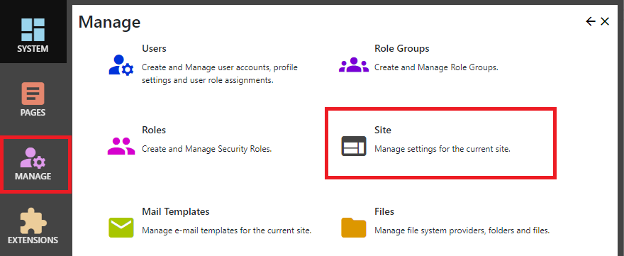
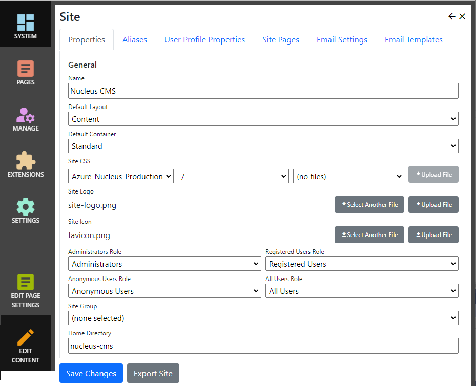

## Site Settings
To manage site settings, after logging in as a system administrator or site administrator, click the `Manage` button to display the Management control panel, then click `Site`. 

If you are logged on as a system administrator, you can also manage or add site from the `Settings` control panel.  Additional sites have their own set of pages and users.

> **_NOTE:_**   Nucleus version 1.0 has user interface elements which allow you to set up `Site Groups` and assign sites to site groups.  In the future, this will allow you to 
share users between sites, but this functionality has not yet been implemented. 

## Properties
|                  |                                                                                      |
|------------------|--------------------------------------------------------------------------------------|
| Name             | A name for your site.  This is used in the control panel, and could be displayed on-screen, depending on your selected layout.  |
| Default Layout   | Specifies a default layout to be used by pages which do not specify a layout.  |
| Default Container| Default module container for the site.  Modules which which do not specify a layout use the page default, and if the page default is not set they use the site default container.  |
| Site CSS         | Specifies a CSS file which is referenced by all pages within your site.  This setting is optional, and is used to apply site-specific CSS.  |
| Site Logo        | Your site logo is an image file which is displayed by the logo Html Helper/Tag Helper.  Some layouts may not display a logo. |
| Site Icon        | The site icon is a "favicon".  If specified, it is the icon displayed by your browser in the address bar. |
| Roles            | If required, you can change the administrators, registered users, anonymous users and all users roles.  These settings will generally not need to be changed.   |
| Site Group       | Assigns a site group to your site.  In Nucleus version 1.0, the site group setting has no effect. |
| Home Directory   | Specifies a sub-folder at the top level of your file system where site files are stored. |

## Aliases
An alias is your site's domain name or domain and virtual directory.  Aliases are used to identify the requested site, as they are the first part of a request Url.  Do 
not include the Uri scheme (http:// or https://).

One alias can be set as the default alias for your site.  The default alias is used when rendering links, images and other output.  If no default alias is defined, the first 
alias is used as the default.

## User Profile Properties
User properties are not fixed - you can add and remove them so that user registrations contain the information that you need.  User profile properties define which properties are included 
in a user registration.

|                  |                                                                                      |
|------------------|--------------------------------------------------------------------------------------|
| Name             | The property name.  This is displayed on-screen as the caption for user input.  |
| Type             | A namespace which identifies the purpose of the property.  Nucleus core, modules and other extensions use the property type to identify profile properties which have a special purpose. |
| Help Text        | If specified, help text is used as popup help in the user registration module.  |

Nucleus adds user properties as [Claims](https://docs.microsoft.com/en-us/windows-server/identity/ad-fs/technical-reference/the-role-of-claims) which
are added to the user's identity.  Nucleus Core, modules and other extensions use claims to access user profile properties by their type.  Use standard identity 
namespaces for your property types where possible.

> **_NOTE:_**   The Email and Mobile phone properties are important, because they can be used to communicate with your users - password resets, forum subscription notifications, two factor 
authentication and other functions may require an email address, mobile phone number, or both. 

## Site Pages
User management and other special-use pages are configurable.

|                  |                                                                                      |
|------------------|--------------------------------------------------------------------------------------|
| Login Page       | A page containing a login module.  This page is used when the user clicks a logon button, or is redirected after trying to access a secure page.  |
| User Profile     | A page containing a user registration module, used to manage an existing user's properties.    |
| User Registration| A page containing a user registration module, used to sign up a new user.   |
| Change Password  | A page containing a change password module, used by users to change their password.  |
| Terms of Use     | The target of a Terms Html Helper/Tag helper.  Layouts can use the terms helper to include a link on a page.  |
| Privacy          | The target of a Privacy Html Helper/Tag helper.  Layouts can use the privacy helper to include a link on a page..  |
| Page Not Found   | A page containing content for display when a request is received for an Url that isn't valid.  |
| Error Page       | A page containing content for display when an erroc occurs.  The ErrorReport module can be used on this page to display error information, or you can just use a Text/Html or other module.  |

## Email Settings
Email settings used to send messages to users.

|                  |                                                                                      |
|------------------|--------------------------------------------------------------------------------------|
| SMTP host        | Your email server address.  |
| SMTP port        | Your email server's port.  Most servers use port 587. |
| Use SSL          | Specifies whether to use SSL to secure communications.  You should use SSL if your email server supports it.  |
| Sender Email     | The email address which will be set as the sender address for emails sent by Nucleus.  |
| User Name        | Your SMTP user name.  |
| Password         | Your SMTP password.  |

## Email Templates
Use the email templates tab to assign email templates to specific site functions.  Email templates are created and managed by clicking "Manage" and then "Mail Templates".  

|                  |                                                                                      |
|------------------|--------------------------------------------------------------------------------------|
| Welcome new user      | Email template used to generate a welcome email when a new user account is created.  |
| Account name reminder | Email template used to generate an email when the user clicks 'Trouble Logging in' in the login page, and requests a user name reminder. |
| Password Reset        | Email template used to generate an email when the user clicks 'Trouble Logging in' in the login page, and requests a password reset.  |
