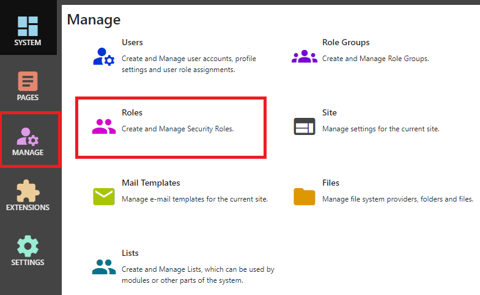

## Roles
After logging in as a system administrator or site administrator, you can manage users by clicking the `Manage` button to display the Manage 
control panel, then click `Roles`.

## Properties
|                  |                                                                                      |
|------------------|--------------------------------------------------------------------------------------|
| Name             | The name of your role.  This is displayed anywhere that administrators need to select roles. |
| Description      | A role description can help you to remember the purpose of a role.  |
| Role Group       | Roles can be assigned to role groups.  In some pages where you need to select a role, they are displayed grouped by role group.  This can be helpful if you have a lot of roles. |
