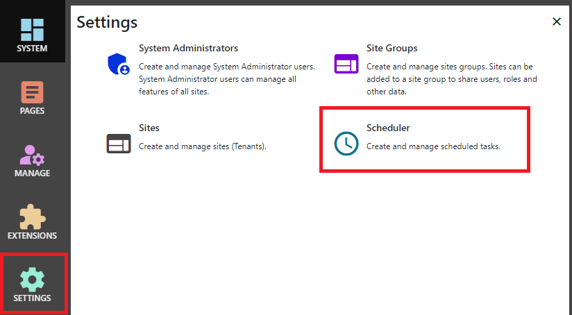
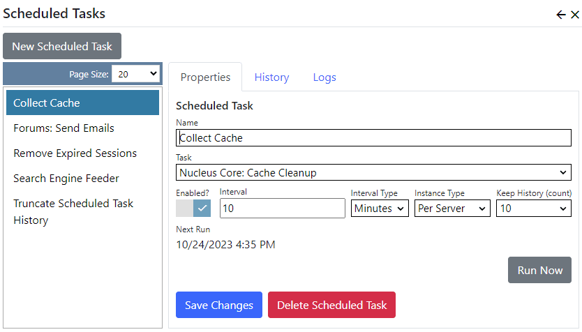

Scheduled tasks perform their work periodically and are generally used to perform system maintenance, like expiring cache entries or updating a search 
index.  Scheduled Tasks implementations can by provided by Nucleus core, or by installed extensions.

Some of the core Scheduled Tasks have schedules created automatically by the installation wizard.  For tasks which are part of an extension, you 
will need to create a schedule.

After logging in as a system administrator or site administrator, you can access the scheduler by clicking the `Settings` button to display the Settings 
control panel, then click `Scheduler`.

To create a new schedule, click `New Scheduled Task`.  To modify an existing schedule, click it in the list on the left.

## Properties
|                  |                                                                                      |
|------------------|--------------------------------------------------------------------------------------|
| Name             | The name of your schedule is displayed in administration pages, and is also the sub-directory name for scheduled task logs.  |
| Type Name        | The type name of the class which implements the scheduled task interface.  This is a drop-down list, which is automatically populated with all available task classes.  |
| Enabled          | Specifies whether the schedule is enabled.  You can use this setting to temporarily disable a schedule.  |
| Interval         | The interval and interval type specify how often the schedule runs.  You can set an interval in minutes, hours, days, weeks, months or years.  |
| Instance Type    | In a load-balanced environment, this setting specifies whether the task runs on all web servers, or whether it only needs to run per-instance. The approriate selection depends on what the scheduled task does. |
| Keep History     | Specifies the number of history records that are retained for the schedule. |

## History
Use the history tab to view past scheduled task runs and their completion status.

## Logs
If you have enabled the Nucleus Text File logger, you can use the logs tab to view log entries for the scheduled task.  Scheduled task logs are kept for 7 days.  Not all scheduled tasks write log entries.

> You can use the `Run Now` button to schedule the task to run immediately.  

> The Nucleus Task Scheduler checks for scheduled tasks to run every 60 seconds.  