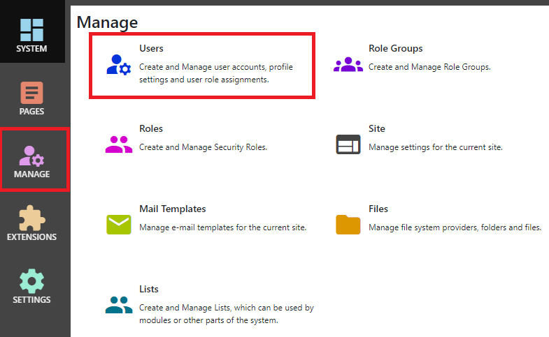

## Users
After logging in as a system administrator or site administrator, you can manage users by clicking the `Manage` button to display the Manage 
control panel, then click `Users`.

## Basic Properties 
All users have a user name.  This is used to log in to the site.  

> A password is not mandatory.  A user without a password will not be able to log in using the standard login module, but could potentially 
log in using an Authenticator App, OpenID Connect provider or other federated identity provider.

## Profile
Set a user's profile settings in the `Profile` tab.  All user profile properties are configurable in the Site Settings page.

## Roles
Assign a user to one or more roles in the roles tab.  Pages and Modules are configured with permissions, which refer to roles, so users have 
permissions because they are assigned to roles.
