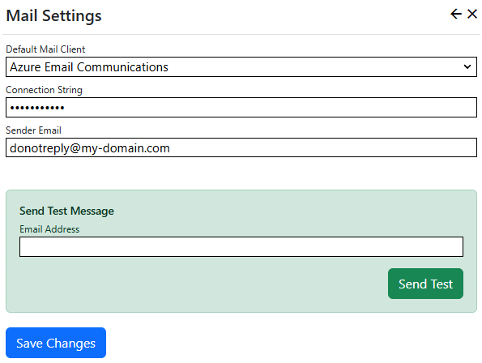

## Setup

### Azure Setup
> You must create both a **Communication Service** and a **Email Communication Service** in Azure.

1. In Azure Portal, [Create a Email Communication Service](https://learn.microsoft.com/en-us/azure/communication-services/quickstarts/email/create-email-communication-resource?pivots=platform-azp).
2. Follow the on-screen steps to connect and verify your email domain.
3. In Azure Portal, [Create a Communication Service](https://learn.microsoft.com/en-us/azure/communication-services/quickstarts/create-communication-resource?tabs=windows&pivots=platform-azp). \
Note that the *Communication Service* is a different service than the *Email Communication Service* that you created in step 1, and you need to create both.
4. Open the *Communication Service* in Azure Portal and navigate to the Email/Domains page.
5. Select your subscription and resource group, then select the *Email Communication Service* that you created in step 1, and the domain you 
connected in step 2.
5. Click Connect.
6. Use the "Email/Try Email" page in Azure Portal to check that the services are correctly configured.
7. In Azure Portal, open your *Email Communications Service*, click Settings/Provision Domain, then click
your domain name. Click "Email Services/MailFrom Addresses" and add your sender address.
> As at August 2024, the Azure Portal does not allow users to add MailFrom addresses unless they have 
applied for a quota increase.  You must send a [Quota increase for email domains](https://learn.microsoft.com/en-us/azure/communication-services/concepts/email/email-quota-increase) 
request by raising a support request in Azure Portal. If you don't want to send a quota increase request, or you are waiting for it to be processed, 
then you must use the auto-generated "donotreply@your-domain.com" sender address.

8. Go to the "Overview" page for your Communication Service, and click "Manage Keys", then copy the Connection String. You
need to paste the Connection String into the Azure Email Communications settings page in Nucleus.

### Nucleus Setup
1. Install the Nucleus [Azure Email Communications mail provider extension](/store/home/inventua/azure-mail-communication).
2. In Nucleus, after logging on as a system administrator or site administator, click "Manage" and then click "Mail Settings".
3. Select "Azure Email Communications" from the *Default Mail Client* drop-down list. Paste your connection string and enter your
sender email address.

Use the "Send Test" form at the bottom of the page to test your settings, then click "Save Changes". 