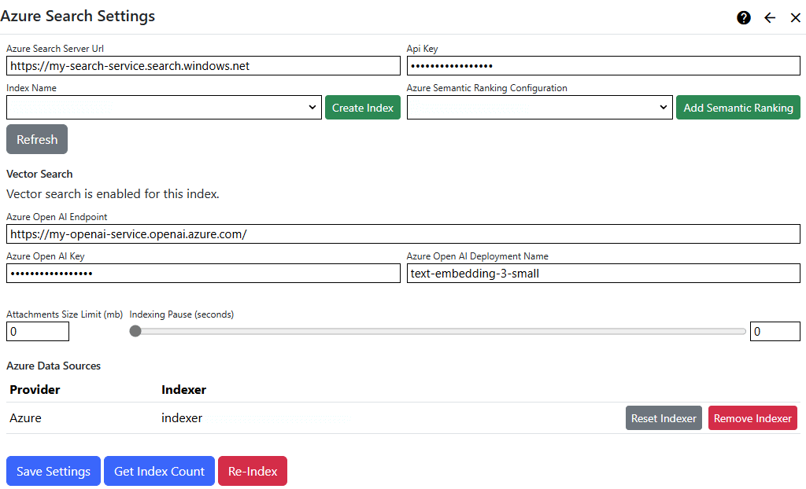

## Azure Search Extension
The Azure Search extension provides a search index manager and a search provider (it feeds an Azure Search index and retrieves search results).  

> 1. You need an 
[Azure Search](https://learn.microsoft.com/en-us/azure/search/search-what-is-azure-search) service to use the Azure Search provider.  
> 2. Azure Search can only extract content from files (like PDFs, Word documents and other formats) which are stored in an 
[Azure Blob Storage](https://learn.microsoft.com/en-us/azure/storage/blobs/storage-blobs-introduction) service. If you want to extract content from files 
for inclusion in the search index and are not using Azure Storage, you should choose another search provider, like [Elastic Search](/other-extensions/elastic-search/). If you just want 
to index file meta-data, along with your site content, you can use Azure Search, but you won't get results when searching terms from within your file's contents.

### How it works

#### Nucleus
The Nucleus search system is built to support a variety of search services. The Nucleus search system consists of:
- **Search meta-data providers**: Extensions and core components of Nucleus implement meta-data providers, which provide data to the search indexing system. The 
core includes meta-data providers for site pages and files, and modules (like Documents and Forums) also "publish" their data by implementing their own meta-data 
providers.
- **Search index managers**: Search extensions may implement a search index manager in order to populate an index. All configured search index managers receive all
data from meta-data providers, and use meta-data however to populate their index. Some search extensions (like a Google custom search) don't have a search index 
manager and just provide a search provider. 
- **Search providers**: Search providers retrieve search results from an index.
- The **[Search Module](/documentation/modules/search/)** presents a search user interface so that users can perform a search, and view results.
- A [search feeder scheduled task](/other-extensions/azure-search/#search-feeder-scheduled-task) runs periodically. It calls all meta-data providers and passes their data to all search index managers.

The Azure Search extension provides a search index manager and a search provider, so it can populate your Azure Search index, and query it for search results.

#### Azure Search
The Azure Search index feed process consists of two parts: 
- A "push" feed (search index manager) which runs on your server, and populates the Azure Search index with site content from Nucleus. File meta-data is 
saved in your index by the "push" feed, but file content is not extracted and added to the index, because the Azure Search service doesn't support 
[document cracking](stage-1-document-cracking#stage-1-document-cracking) from a push feed. \
An exception to this is text files. The contents of plain text and markdown files are included in the index by the "push" feed.
- A "pull" feed - which is an [Azure Search Indexer](https://learn.microsoft.com/en-us/azure/search/search-indexer-overview) - extracts document content from 
files stored in your Azure Blob Storage service. The indexer runs in Azure and supplements the data in your index with content from within your files. If 
selected, the indexer is executed automatically during the "push" feed process. \
\
It doesn't matter what order the "push" and "pull" feeds run in, as they each update different fields in the index, but
your content won't be searchable until the "push" feed has run, because the meta-data that is populated in the index is 
required by the [search module](/documentation/modules/search/).

The Azure Search extension settings are accessed in the `Manage` control panel.

### Settings

{.table-25-75}
|                           |                                                                                      |
|---------------------------|--------------------------------------------------------------------------------------|
| Azure Search Server Url   | Enter the domain name or address of the Azure Search service, including the scheme (http: or https:). The Azure Search service Url is displayed in the Azure Portal/Azure Search/Overview page. |
| Index Name                | Enter an index name.  The index is created automatically.  Index names must be lower case, can contain only letters, numbers, dashes and underscores and must be 2-128 characters. |
| Api Key                   | Enter your Azure Search service API key. You can get your API key from the Azure Portal/Azure Search/Settings/Keys page. |
| Azure Search Indexer      | If specified, the selected indexer is automatically executed when Nucleus feeds data to your Azure Search index.  You can automatically create an indexer by clicking the `Create` button on the right-hand side of the settings page. |
| Attachments Size Limit    | You can specify an upper size limit (in mb) for documents which are submitted to the index.  Documents which are larger than the size limit will have index entries containing meta-data only.  To specify no limit, enter zero (0). |
| Indexing Pause            | You can specify an pause in-between each indexing operation (in seconds), or zero for no pause. See additional information below. |

#### Indexing Pause
The indexing pause is used to reduce the load on your server during search feed processing.  In some hosting environments, the search feed can exhaust 
memory, processor or TCP connection limits.

Pausing in-between submitting each index entry gives the server time to free up resources.  This setting makes your search feed 
take longer to run, but can prevent it from failing.  If you are hosting in an Azure App Service, this setting is important, as Azure automatically stops 
and restarts applications which have too many TCP ports open.  

If you are hosting in an Azure App Service, try an indexing pause of 2.5 seconds.  This will reduce the 
number of HTTP requests to 24 per minute, which gives the Azure time to release unused 
[SNAT](https://learn.microsoft.com/en-us/azure/load-balancer/load-balancer-outbound-connections) ports.  For a search index with 5000 entries, this would 
increase the search feed duration to around 3.5 hours.

### Tools
|                           |                                                                                      |
|---------------------------|--------------------------------------------------------------------------------------|
| Get Index Count           | Displays the number of entries in the index, for use when troubleshooting or verifying that your server is functioning correctly. |
| Clear Index               | Use the `Clear Index` function to delete your index.  It will be automatically re-created the next time that the index feeder task runs. |
| Create Indexer            | Use the `Create` button next to the `Azure Search Indexer` drop-down to automatically create an indexer for your Azure Storage files. |

## Search Feeder Scheduled Task
> Nucleus has a built-in [Scheduled Task](/manage/task-scheduler/) which collects data from all installed search meta-data providers, and submits that data to all installed 
search index managers.  You must create and enable the scheduled task in the `Settings/Scheduler` control panel as it is not enabled by default.

## Advanced Settings

**Scoring Profiles**: If you want to control the weighting of fields when scoring search results (also known as "boost" settings), you can create a "scoring profile" for 
your index in the Azure Portal. Refer to the Microsoft documentation for 
[Scoring Profiles](https://learn.microsoft.com/en-us/azure/search/index-add-scoring-profiles) for more information.

**Semantic Ranking**: For paid Azure Search service tiers, you can enable [semantic ranking](https://learn.microsoft.com/en-us/azure/search/semantic-search-overview) to 
improve search relevance. You can enable semantic ranking in Azure Portal. 

**Skillsets**: You can configure [skill sets](https://learn.microsoft.com/en-us/azure/search/cognitive-search-working-with-skillsets) in Azure Portal to enrich your document (file) 
content when the Azure Search indexer runs. Most built-in skill sets use Azure AI Services.

> *Note:* Make sure to check pricing for Azure services before enabling them. Microsoft charges extra for 
[semantic ranking (pricing)](https://learn.microsoft.com/en-us/azure/search/semantic-search-overview#availability-and-pricing) and
[AI services (pricing)](https://azure.microsoft.com/en-au/pricing/details/cognitive-services/) in addition to your Azure Search service. 
