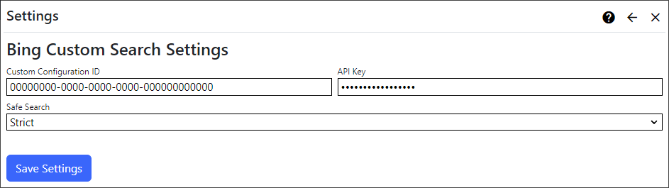

## Bing Custom Search Extension
The Bing Custom Search extension provides a search provider using the Custom Search API to retrieve search results.  

The Bing Custom Search extension uses the Bing Custom Search API to deliver search results for your site. To set it up, you'll need to configure 
a Custom Search Configuration instance, which will provide you with a Custom Configuration ID. You also need a API Key from the [Azure Portal](https://portal.azure.com/)
to use the Custom Search API.

The Bing Custom Search extension settings are accessed in the `Manage` control panel.

## Settings

{.table-25-75}
|                            |                                                                                      |
|----------------------------|--------------------------------------------------------------------------------------|
| API Key                    | Get the Bing API Key from the Azure Portal. Refer to the Azure Portal (API Key) section below for more details. |
| Custom Configuration ID    | Get your Bing Custom Search Configuration ID from [https://www.customsearch.ai/](https://www.customsearch.ai/). Refer to the Custom Search Configuration section below for more details.|
| Safe Search                | Configure [SafeSearch filtering](https://support.microsoft.com/en-au/topic/turn-bing-safesearch-on-or-off-446ebfb8-becf-f035-9eea-b660e8420458) for your search engine. |

## Custom Search Configuration
Set up a [Bing Custom Search Configuration](https://www.customsearch.ai/) instance then click the `Summary` tab to view your Custom Configuration ID. 

## Azure Portal (API Key)
Create a Bing Custom Search resource in [Azure Portal](https://portal.azure.com/). Once it has been provisioned, view the service details in Azure Portal and click `Manage Keys` in 
the Overview page to get the API key.

## Supported Capabilities

