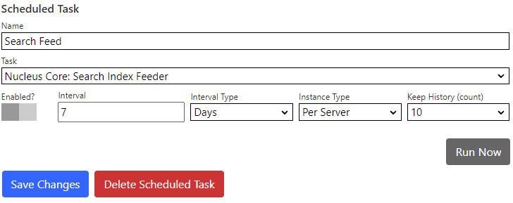

## Elastic Search Extension
The Elastic Search extension provides a search index manager and a search provider (it both feeds the search index and retrieves search results).  

> You need an 
[Elastic Search](https://www.elastic.co/) server to use the Elastic Search provider.  If you are setting up your own Elastic Search server, make sure to 
install the [Ingest Attachment plugin](https://www.elastic.co/guide/en/elasticsearch/plugins/current/ingest-attachment.html).

### How it works

#### Nucleus
The Nucleus search system is built to support a variety of search services. The Nucleus search system consists of:
- **Search meta-data providers**: Extensions and core components of Nucleus implement meta-data providers, which provide data to the search indexing system. The 
core includes meta-data providers for site pages and files, and modules (like Documents and Forums) also publish their data by implementing their own meta-data 
providers.
- **Search index managers**: Search extensions may implement a search index manager in order to populate an index. All configured search index managers receive all
data from meta-data providers, and use meta-data however to populate their index. Some search extensions (like a Google custom search) don't have a search index 
manager and just provide a search provider. 
- **Search providers**: Search providers retrieve search results from an index.
- The **[Search Module](/documentation/modules/search/)** presents a search user interface so that users can perform a search, and view results.
- A [search feeder scheduled task](/other-extensions/elastic-search/#search-feeder-scheduled-task) runs periodically. It calls all meta-data providers and passes their data to all search index managers.

#### Elastic Search
The Elastic Search extension provides a search index manager and a search provider, so it can populate your Elastic Search index, and query it for search results.

The Elastic Search extension settings are accessed in the `Manage` control panel.

## Settings

{.table-25-75}
|                           |                                                                                      |
|---------------------------|--------------------------------------------------------------------------------------|
| Elastic Search Server Url | Enter the domain name or address of the Elastic Search server, including the scheme (http: or https:) and port.  The default port is 9200.  For example, https://192.168.1.100:9200. |
| Index Name                | Enter an index name.  The index is created automatically.  Index names must be lower case, may not  include \, /, *, ?, ", &lt;, &gt;, &#124;, (space character) or # and must be less than 255 bytes. |
| User name, password       | Enter your Elastic Search user name and password.  If your Elastic Search server does not have security configured, you can leave these fields empty. |
| Certificate Thumbprint    | Enter your Elastic Search certificate thumbprint.  If your Elastic Search server does not have a certificate configured, you can leave this value blank. |
| Attachments Size Limit    | You can specify an upper size limit (in mb) for documents which are submitted to the index.  Documents which are larger than the size limit will have index entries containing meta-data only.  To specify no limit, enter zero (0). |
| Indexing Pause            | You can specify an pause in-between each indexing operation (in seconds), or zero for no pause. See additional information below. |
| Boost Settings            | You can increase or decrease the boost for some search index fields.  This influences the relevance of a document when you are searching, and results are sorted by relevance.  The default boost value for all fields is 1. |
|  - Title                   | Boost the page title, or the file name for files. |
|  - Summary                 | Boost the page summary (not relevant for files). |
|  - Categories              | Boost categories.  Page and file index entries do not currently set categories, but modules may set one or more categories for an index entry. |
|  - Keywords                | Boost page keywords (not relevant for files).   |
|  - Content                 | Boost the page or file content. Elastic search can parse a number of file formats, including office documents and PDFs.  |
|  - Attachment Fields       | (Title, Name, Author, Keywords) Some document formats contain embedded meta-data.  Use the attachment fields boost to increase the relevance of these values. |

### Indexing Pause
The indexing pause is used to reduce the load on your server during search feed processing.  In some hosting environments, the search feed can exhaust 
memory, processor or TCP connection limits.

Pausing in-between submitting each index entry gives the server time to free up resources.  This setting makes your search feed 
take longer to run, but can prevent it from failing.  If you are hosting in an Azure App Service, this setting is important, as Azure automatically stops 
and restarts applications which have too many TCP ports open.  

If you are hosting in Azure, try an indexing pause of 2.5 seconds.  This will reduce the 
number of HTTP requests to 24 per minute, which gives the Azure time to release unused 
[SNAT](https://learn.microsoft.com/en-us/azure/load-balancer/load-balancer-outbound-connections) ports.  For a search index with 5000 entries, this would 
increase the search feed duration to around 3.5 hours.

## Tools
|                           |                                                                                      |
|---------------------------|--------------------------------------------------------------------------------------|
| Get Index Count           | Displays the number of entries in the index, for use when troubleshooting or verifying that your server is functioning correctly. |
| Get Index Settings        | Displays Elastic Search configuration information. |
| Clear Index               | Use the `Clear Index` function to delete your index.  It will be automatically re-created the next time that the index feeder task runs. |

## Search Feeder Scheduled Task
> Nucleus has a built-in Scheduled Task which collects data from all installed search meta-data providers, and submits that data to all installed search index managers.  You 
must create and enable the scheduled task in the `Settings/Scheduler` control panel as it is not enabled by default.

See Also: [Setting up Self-Managed Elastic Search on a Azure Virtual Machine running Ubuntu Linux](/news/setting-up-self-managed-elastic-search-on-a-azure-virtual-machine-running-ubuntu-linux-) 