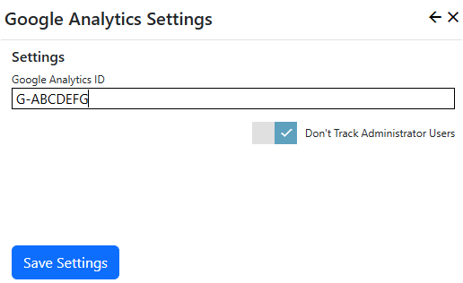

## Google Analytics Extension
The Google Analytics extension adds elements to your page output to report analytics data to Google Analytics.

> The Google Analytics extension provides an interface to Google Analytics, but you must set up a 
[Google Analytics](https://analytics.google.com) site first.  You will need your Google Analytics measurement 
ID from the Google Analytics site.

The Google Analytics extension settings are accessed in the `Manage` control panel.

## Settings

{.table-25-75}
|                     |                                                                                      |
|---------------------|--------------------------------------------------------------------------------------|
| Google Analytics ID | Enter your Google Analytics measurement ID.  If you want to temporarily disable Google Analytics reporting, set this entry to blank.  |
| Don't track Administrator Users | Specifies that Analytics should not track activity when a system administrator or site administrator is logged in.  |
