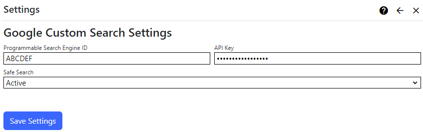

## Google Custom Search Extension
The Google Custom Search Extension uses the [Google Programmable Search Engine](https://programmablesearchengine.google.com/about/) service to 
retrieve search results from Google and display them in your site. To set it up, you'll need a Search Engine ID and an API Key. 

> You should review [Google Programmable Search Engine Pricing](https://support.google.com/programmable-search/answer/9069107?hl=en) before you set up 
the service. The Google Custom Search Extension uses the JSON API. 

The Google Custom Search extension settings are accessed in the `Manage` control panel.

## Settings

{.table-25-75}
|                               |                                                                                      |
|-------------------------------|--------------------------------------------------------------------------------------|
| Programmable Search Engine ID | Use the [Programmable Search Engine site](https://programmablesearchengine.google.com/controlpanel/all) to generate a Search engine ID. |
| API Key                       | Use the [Cloud console](https://console.cloud.google.com/apis/credentials) to create or retrieve your Google API Key. Refer to the Programmable Search Engine and API sections below for more details. |
| Safe Search                   | Configure SafeSearch filtering for your search engine. Options are: `SafeUndefined` (use the value from your engine's configuration), `Active` or `Off`. |

## Programmable Search Engine 
Generate your Search Engine ID by creating a search engine.  The Google Programmable Search Engine [control panel documentation](http://support.google.com/programmable-search/) 
provides more information on customizing the Custom Search service on retrieving information from your sites. You can specify areas of your site with the possibilities of 
including and excluding pages or sites in your configuration.  You can customize security, UI, statistics and logging features. 

## API Key
You will need to create credentials in the form of an API key to access the Custom Search service. The API key can be created by using the 
[Google Cloud console](https://console.cloud.google.com/apis/credentials).

## Supported Capabilities
The Google Custom Search search provider is limited by the features of the Google Programmable Search Engine service, and does not support all of
the capabilities of the Nucleus [Search Module](/documentation/modules/search/).

{.table-sm}
| Capability                   | Supported?                                                                           |
|------------------------------|--------------------------------------------------------------------------------------|
| Search Suggestions           | No                                                 |
| Filter By Scope              | No                                                 |
| Maximum Page Size            | 10                                                 |
| Meta-data Display            |                                                    |
| - Categories                 | No                                                 |
| - Result Score               | No                                                 |
| - Size                       | No                                                 |
| - Published Date             | No                                                 |
| - Resource Type              | No                                                 |
| - Matched Terms Highlighting | No                                                 |

