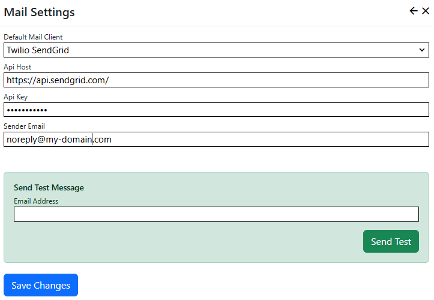

## Setup
1. Set up your SendGrid Service at [SendGrid](https://sendgrid.com/en-us). Once you have followed the steps to set up the service and verify your domain,
Navigate to the [SendGrid](https://app.sendgrid.com/) management site and click the "API Keys" menu item in the "Settings" section. Create an API key, and 
make to copy and store it safely - you can only view API keys immediately after they have been created.
2. Install the Nucleus [SendGrid mail provider extension](/store/home/inventua/sendgrid-mail).
3. In Nucleus, after logging on as a system administrator or site administator, click "Manage" and then click "Mail Settings".
4. Select "Twilio SendGrid" from the *Default Mail Client* drop-down list. Enter your API host (or leave it as default), paste your API key and enter your
sender email address.

Use the "Send Test" form at the bottom of the page to test your settings, then click "Save Changes". 