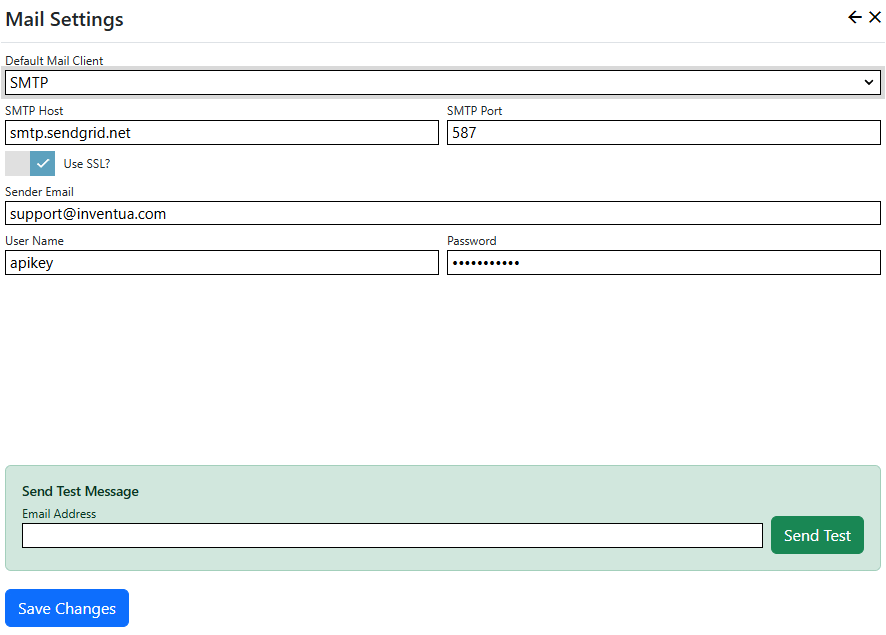

The SMTP mail provider sdds support for sending emails using SMTP. In most Nucleus installations, it is installed by default.

## Setup
1. Install the Nucleus [SMTP mail provider extension](/store/home/inventua/smtp-mail).
2. In Nucleus, after logging on as a system administrator or site administator, click "Manage" and then click "Mail Settings".
3. Select "SMTP Mail" from the *Default Mail Client* drop-down list. 
4. Enter your SMTP mail server settings.

Use the "Send Test" form at the bottom of the page to test your settings, then click "Save Changes". 

> The SMTP mail provider includes a "Pickup Directory" mail provider, which saves emails to a folder instead of sending them. This 
is a useful option for development and testing.