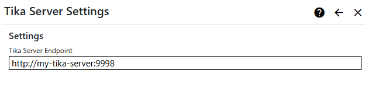

## Tika Server Converter
The Tika Server Converter extension is used by search index managers to call a Apache Tika Server to extract content from documents and other content.

> You need a 
[Apache Tika Server](https://cwiki.apache.org/confluence/display/TIKA/TikaServer) to use the Tika Server Converter extension. 

### How it works
Depending on the built-in functionality of each search service or application, a Search Index Manager may need to extract content from documents or 
other content. The most common requirement is to extract content in plain text format. For example, if you host PDF documents on your web site, your 
search index manager may need to extract plain text content from them in order to create index entries, including 
[vectors](https://learn.microsoft.com/en-us/azure/search/vector-search-overview#vector-search-concepts) (embeddings). 

Nucleus has a built-in simple content converter which can extract text from HTML, Markdown and PDF content. If you don't need to extract content from other
formats, you can use the built-in content converter and you don't need the Tika Server converter. You don't need to configure anything if you are using the 
simple built-in content converter.

Tika can extract content from a large number of common [formats](https://tika.apache.org/1.10/formats.html). You should use the Tika Server Converter and 
a [Tika Server](https://cwiki.apache.org/confluence/display/TIKA/TikaServer) when you want to populate your search index from files in Office/OpenOffice and 
other formats.

## Settings
To configure the Tika Server Converter, log on as a system administrator or site administator, click "Manage" and then click "Tika Server Converter".

{.table-25-75}
|                           |                                                                                      |
|---------------------------|--------------------------------------------------------------------------------------|
| Tika Server Endpoint      | Enter the endpoint (URL) for your Tika server, including the port, which is normally 9998.  |

