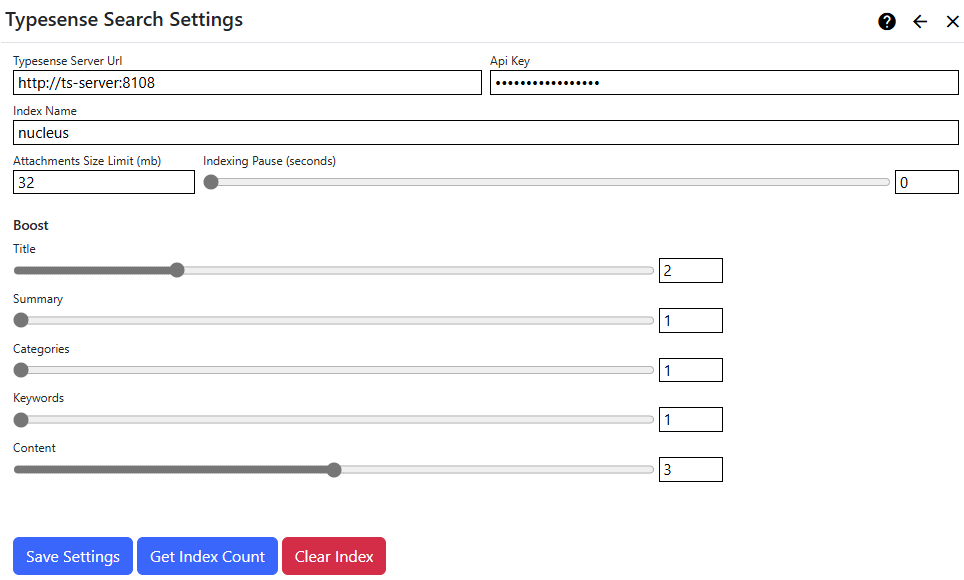

## Typesense Search Extension
The Typesense Search extension provides a search index manager and a search provider (it both feeds the search index and retrieves search results).  

> You need a 
[Typesense Search](https://typesense.org/docs/guide/#quick-start) server to use the Typesense Search provider. For improved search results, you can optionally use a 
[Tika](https://cwiki.apache.org/confluence/display/TIKA/TikaServer#TikaServer-InstallationofTikaServer) server for file data extraction. You can install 
Typesense on your own server, or you can use the [Typesense Cloud](https://cloud.typesense.org/) hosted service.

### How it works

#### Nucleus
The Nucleus search system is built to support a variety of search services. The Nucleus search system consists of:
- **Search meta-data providers**: Extensions and core components of Nucleus implement meta-data providers, which provide data to the search indexing system. The 
core includes meta-data providers for site pages and files, and modules (like Documents and Forums) also publish their data by implementing their own meta-data 
providers. Pages and Folders have a "Include in search" setting to control whether they are included in the search index.
- **Search index managers**: Search extensions may implement a search index manager in order to populate an index. All configured search index managers receive all
data from meta-data providers, and use meta-data however to populate their index. Some search extensions (like a Google custom search) don't have a search index 
manager and just provide a search provider. 
- **Search providers**: Search providers retrieve search results from an index.
- The **[Search Module](/documentation/modules/search/)** presents a search user interface so that users can perform a search, and view results.
- A [search feeder scheduled task](/other-extensions/typesense-search/#search-feeder-scheduled-task) runs periodically. It calls all meta-data providers 
and passes their data to all search index managers.

#### Typesense Search
The Typesense Search extension provides a search index manager and a search provider, so it can populate your Typesense Search index, and query it for search results.

The Typesense Search extension settings are accessed in the `Manage` control panel.

When creating each index entry, the Typesense index provider:
- Calls your [Tika](https://cwiki.apache.org/confluence/display/TIKA/TikaServer#TikaServer-InstallationofTikaServer) server to extract plain text from file and other content, if you have configured a Tika server Url.
- Splits large content into chunks, so that vector embedding works better.
- Creates a vector embedding using the [gte-large](https://huggingface.co/thenlper/gte-large) language model. Vector search and embedding are built in 
to Typesearch.

## Settings

{.table-25-75}
|                           |                                                                                      |
|---------------------------|--------------------------------------------------------------------------------------|
| Typesense Server Url      | Enter the domain name or address of the Typesense Search server, including the scheme (http: or https:) and port.  The default port is 8108.   |
| Index Name                | Enter an index name (in Typesense this is called a 'Collection Name').  The index is created automatically.  |
| Api Key                   | Enter your Typesense API key. |
| Tika Server Url           | Enter your Tika server address, including the scheme (http: or https:) and port. The defaukt port is 9998. If you leave this value empty, search feeds will still work, but most file contents will not be included in the index, only meta-data. |
| Attachments Size Limit    | You can specify an upper size limit (in mb) for documents which are submitted to the index.  Documents which are larger than the size limit will have index entries containing meta-data only.  To specify no limit, enter zero (0). |
| Indexing Pause            | You can specify an pause in-between each indexing operation (in seconds), or zero for no pause. See additional information below. |
| Boost Settings            | You can increase or decrease the boost for some search index fields.  This influences the relevance of a document when you are searching, and results are sorted by relevance.  The default boost value for all fields is 1. |
|  - Title                   | Boost the page title, or the file name for files. |
|  - Summary                 | Boost the page summary (not relevant for files). |
|  - Categories              | Boost categories.  Page and file index entries do not currently set categories, but modules may set one or more categories for an index entry. |
|  - Keywords                | Boost page keywords (not relevant for files).   |
|  - Content                 | Boost the page or file content. If you are using Tika for content extraction, your index will contain the content from many file formats, including office documents and PDFs. |

> The first time that you create a Typesense index, it may take a long time (several minutes), and you may get a timeout error message. This is because Typesense 
automatically downloads the 'gte-large' model that we use for vector embeddings if it not already present. It is a good idea to click the 'Get Index Count' 
button - which has a side-effect of automatically creating your index - to initiate the download process right away instead of waiting for the search feed task.

### Indexing Pause
The indexing pause is used to reduce the load on your server during search feed processing.  In some hosting environments, the search feed can exhaust 
memory, processor or TCP connection limits.

Pausing in-between submitting each index entry gives the server time to free up resources.  This setting makes your search feed 
take longer to run, but can prevent it from failing.  If you are hosting in an Azure App Service, this setting is important, as Azure automatically stops 
and restarts applications which have too many TCP ports open.  

If you are hosting in Azure, try an indexing pause of 2.5 seconds.  This will reduce the 
number of HTTP requests to 24 per minute, which gives the Azure time to release unused 
[SNAT](https://learn.microsoft.com/en-us/azure/load-balancer/load-balancer-outbound-connections) ports.  For a search index with 5000 entries, this would 
increase the search feed duration to around 3.5 hours.

## Tools
|                           |                                                                                      |
|---------------------------|--------------------------------------------------------------------------------------|
| Get Index Count           | Displays the number of entries in the index, for use when troubleshooting or verifying that your server is functioning correctly. |
| Clear Index               | Use the `Clear Index` function to delete your index.  It will be automatically re-created the next time that the index feeder task runs. |

## Search Feeder Scheduled Task
> Nucleus has a built-in Scheduled Task which collects data from all installed search meta-data providers, and submits that data to all installed search index managers.  You 
must create and enable the scheduled task in the `Settings/Scheduler` control panel as it is not enabled by default.

