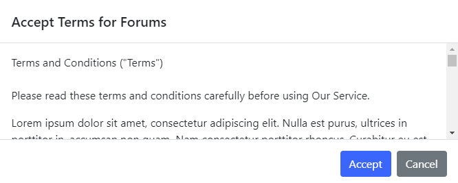
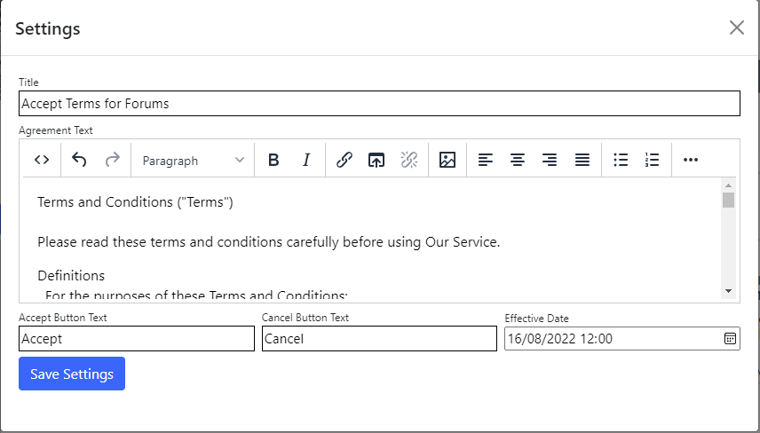

## Accept terms module
The Accept Terms module displays a message with an Accept and Cancel button. The user can accept the terms to continue, or cancel to 
return to the referring page.

To change settings for the module, click the `Settings` tab.

## Settings

{.table-25-75}
|                      |                                                                                      |
|----------------------|--------------------------------------------------------------------------------------|
| Title                | Title displayed as the modal caption.   |
| Agreement Text       | Body text of the terms to display. |
| Accept Button Text   | Specifies the text of the accept button. When a logged-on user accepts terms, a record is saved to the database.  |
| Cancel Button Text   | Specifies the text of the cancel button.  |
| Effective Date       | Specifies the date/time to display the terms.  |

> If the effective date is set, all previous user acceptance records (date-stamped before the effective date) are treated as expired, and users must agree 
to the terms again.
