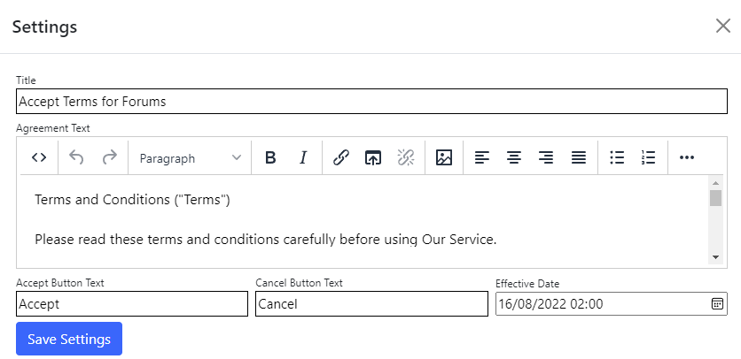

## Accept terms module
The accept terms module enables the end user to abide by the rules and conditions of site. On navigating to the page, it will display a popup for the user to accept the terms and conditions.
If the user chooses to accept, they can proceed to the page. If they decline/cancel the user will be redirected to the previous page.


To change settings for the module, click the `Settings` tab.



## Settings

{.table-25-75}
|                      |                                                                                      |
|----------------------|--------------------------------------------------------------------------------------|
| Title                | Title of the agreement.   |
| Agreement Text       | Body text of the terms and conditions of the agreement. |
| Accept Button Text   | Specifies the text of the accept button.  |
| Cancel Button Text   | Specifies the text of the cancel button.  |
| Effective Date       | Specifies the date/time for the .  |

> If there is no effective date set, the module will default to the minimum datetime and display the accept terms for end users.
> If there is an effective date set is updated or set in the future, it will invalidate all acceptance terms before the effective date.


### Example using terms and conditions (replace the capitilized words within `[]` with the appropriate information)
```
  Terms and Conditions ("Terms")
  
  Please read these terms and conditions carefully before using Our Service.

  Definitions
  For the purposes of these Terms and Conditions:
    ● “Account” means a unique account created for You to access our Service or parts of our Service.
    ● “Company” (referred to as either "the Company", "We", "Us" or "Our" in this Agreement) refers to [COMPANY_INFORMATION].
    ● “Content” refers to content such as text, images, or other information that can be posted, uploaded, linked to or otherwise made available by You, regardless of the form of that content.
    ● “Device” means any device that can access the Service such as a computer, a cellphone or a digital tablet.
    ● “Feedback” means feedback, innovations or suggestions sent by You regarding the attributes, performance or features of our Service.
    ● “Service” refers to the Website.
    ● “Terms and Conditions” (also referred as "Terms") mean these Terms and Conditions that form the entire agreement between You and the Company regarding the use of the Service. 
    ● “Third-party Social Media Service” means any services or content (including data, information, products or services) provided by a third-party that may be displayed, included or made available by the Service.
    ● “Website” refers to [WEBSITE_NAME], accessible from [WEBSITE_URL]
    ● “You” means the individual accessing or using the Service, or the company, or other legal entity on behalf of which such individual is accessing or using the Service, as applicable.

  Acknowledgment
    These are the Terms and Conditions governing the use of this Service and the agreement that operates between You and the Company. These Terms and Conditions set out the rights and obligations of all users regarding the use of the Service.
    Your access to and use of the Service is conditioned on Your acceptance of and compliance with these Terms and Conditions. These Terms and Conditions apply to all visitors, users and others who access or use the Service.
    By accessing or using the Service You agree to be bound by these Terms and Conditions. If You disagree with any part of these Terms and Conditions then You may not access the Service. You represent that you are over the age of 18. The Company does not permit those under 18 to use the Service.
    Your access to and use of the Service is also conditioned on Your acceptance of and compliance with the Privacy Policy of the Company. Our Privacy Policy describes Our policies and procedures on the collection, use and disclosure of Your personal information when You use the Application or the Website and tells You about Your privacy rights and how the law protects You. Please read Our Privacy Policy carefully before using Our Service.

  User Accounts
    When You create an account with Us, You must provide Us information that is accurate, complete, and current at all times. Failure to do so constitutes a breach of the Terms, which may result in immediate termination of Your account on Our Service.
    You are responsible for safeguarding the password that You use to access the Service and for any activities or actions under Your password, whether Your password is with Our Service or a Third-Party Social Media Service.
    You agree not to disclose Your password to any third party. You must notify Us immediately upon becoming aware of any breach of security or unauthorized use of Your account.
    You may not use as a username the name of another person or entity or that is not lawfully available for use, a name or trademark that is subject to any rights of another person or entity other than You without appropriate authorization, or a name that is otherwise offensive, vulgar or obscene.

  Content
  Your Right to Post Content
    Our Service allows You to post Content. You are responsible for the Content that You post to the Service, including its legality, reliability, and appropriateness.
    By posting Content to the Service, You grant Us the right and license to use, modify, publicly perform, publicly display, reproduce, and distribute such Content on and through the Service. You retain any and all of Your rights to any Content You submit, post or display on or through the Service and You are responsible
    for protecting those rights. You agree that this license includes the right for Us to make Your Content available to other users of the Service, who may also use Your Content subject to these Terms.
    You represent and warrant that: (i) the Content is Yours (You own it) or You have the right to use it and grant Us the rights and license as provided in these Terms, and (ii) the posting of Your Content on or through the Service does not violate the privacy rights, publicity rights, copyrights, contract rights or any other rights of any person.

  Content Restrictions
    The Company is not responsible for the content of the Service's users. You expressly understand and agree that You are solely responsible for the Content and for all activity that occurs under your account, whether done so by You or any third person using Your account. 
    You may not transmit any Content that is unlawful, offensive, upsetting, intended to disgust, threatening, libelous, defamatory, obscene or otherwise objectionable. Examples of such objectionable Content include, but are not limited to, the following:
      ● Unlawful or promoting unlawful activity.
      ● Defamatory, discriminatory, or mean-spirited content, including references or commentary about religion, race, sexual orientation, gender, national/ethnic origin, or other targeted groups.
      ● Spam, machine – or randomly – generated, constituting unauthorized or unsolicited advertising, chain letters, any other form of unauthorized solicitation, or any form of lottery or gambling.
      ● Containing or installing any viruses, worms, malware, trojan horses, or other content that is designed or intended to disrupt, damage, or limit the functioning of any software, hardware or telecommunications equipment or to damage or obtain unauthorized access to any data or other information of a third person.
      ● Infringing on any proprietary rights of any party, including patent, trademark, trade secret, copyright, right of publicity or other rights.
      ● Impersonating any person or entity including the Company and its employees or representatives.
      ● Violating the privacy of any third person.
      ● False information and features.

If you have any questions about these Terms and Conditions, You can contact us:
  ● By visiting this page on our website: [WEBSITE_CONTACT_PAGE_URL]
  ● By sending us an email: [WEBSITE_CONTACT_EMAIL]
```

