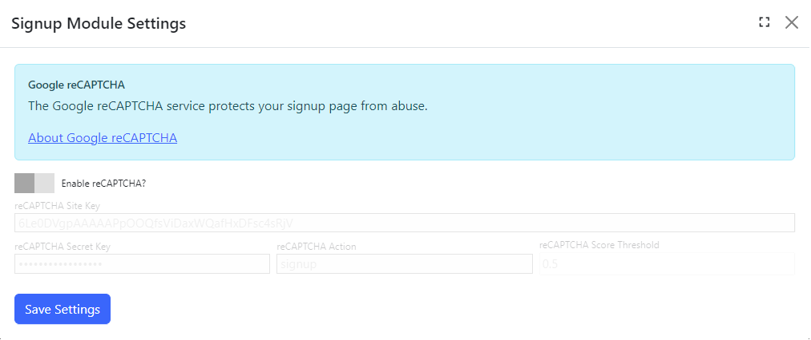

## Signup module
If the site allows for public registration, the signup module is used to register users. 

To change settings for the module, click the `Settings` tab.

## Settings

{.table-25-75}
|                                 |                                                                                      |
|---------------------------------|--------------------------------------------------------------------------------------|
| Enable reCAPTCHA?               | Enables reCAPTCHA to protect the signup form from abuse.                             |
| reCAPTCHA Site Key              | Enter the site key generated by Google. Visit https://www.google.com/recaptcha/admin to get started with reCAPTCHA. |
| reCAPTCHA Secret Key            | Enter the secret key generated by Google. This key is used between your site and reCAPTCHA to verify signup. |
| reCAPTCHA Action                | Enter the action to help the data analysis for your site.                            |
| reCAPTCHA Score Threshold       | Enter the score threshold between 0.0 (most likely bot) to 1.0 (most likely human).  |

> If reCAPTCHA is enabled, a badge will appear on the viewer page to let users know the page is being protected.

