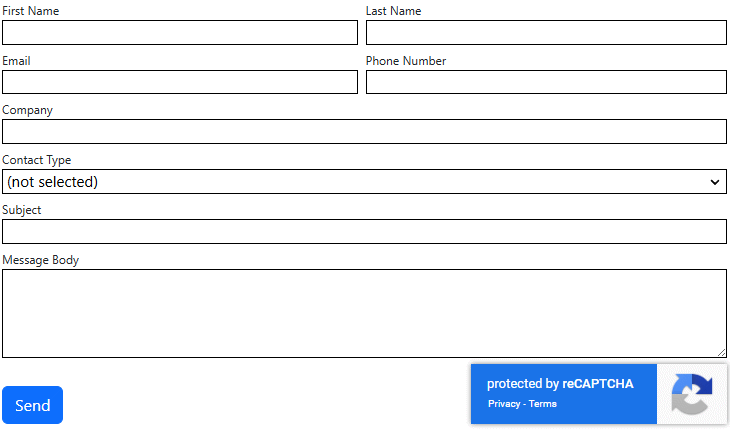
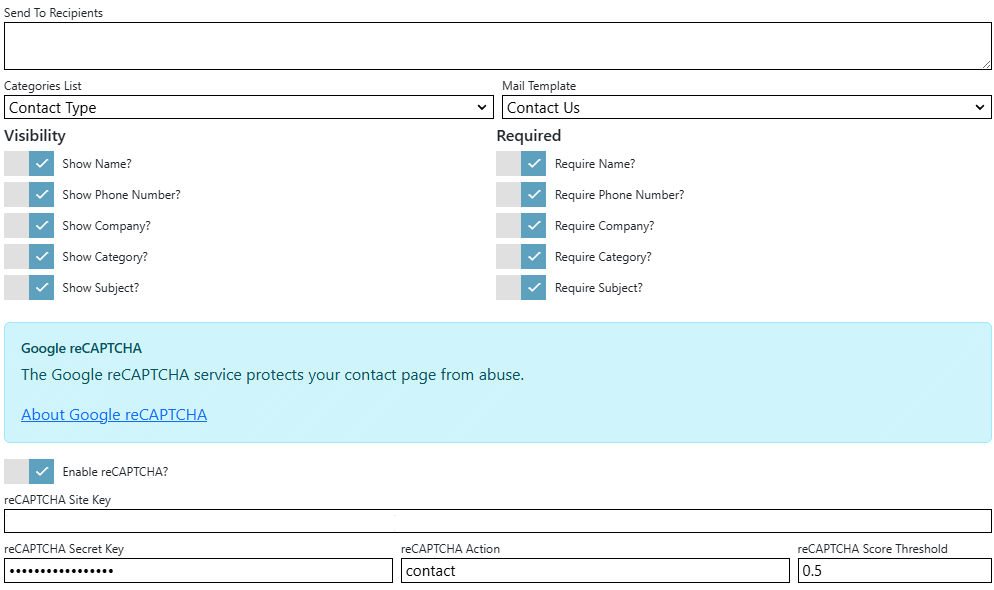

## Contact Us module
The contact us module allows the end-user to send a message to email recipients. 



To change settings for the module, click the `Settings` tab.



## Settings
|                      |                                                                                      |
|----------------------|--------------------------------------------------------------------------------------|
| Send To Recipients   | Specifies the email recipients of the message.  You can specify multiple recipients by using commas to separate them.
| Categories List      | Specifies the list that is used by this module for categories.  If specified, users can assign a category from the list to their nature of enquiry. Lists are managed in the `Lists` editor in the `Manage` control panel. |
| Mail Template        | Specifies the mail template used to inform the email recipients of inquiry/feedback from end-user.  |
| Show Name            | Specifies whether to display the first and last names on-screen.  |
| Show Phone Number    | Specifies whether to display the phone number on-screen.  |
| Show Company         | Specifies whether to display the company name on-screen.  |
| Show Category        | Specifies whether to display the category list on-screen.  |
| Show Subject         | Specifies whether to display the subject of the message on-screen.  |
| Require Name         | Specifies whether the first and last names are mandatory on-screen.  |
| Require Phoone Number| Specifies whether the phone number is mandatory on-screen.  |
| Require Company      | Specifies whether the company name is mandatory on-screen.  |
| Require Category     | Specifies whether the category list is mandatory on-screen.  |
| Require Subject      | Specifies whether the subject of the message is mandatory on-screen.  |

> If there are no recipients specified, the module will display a warning to administrators and will be blank for end-users.
> If a mail template is not selected, the module will display a warning to administrators and will be blank for end-users.


## Mail Template
The mail template specifies the format and content of email sent to the specified recipients. The mail template arguments specific to the Contact Us module are:
|                     |                                                                                      |
|---------------------|--------------------------------------------------------------------------------------|
| Message.FirstName   | The first name of the sender. |
| Message.LastName    | The last name of the sender. |
| Message.Company     | The company name of the sender. |
| Message.Email       | The email address of the sender. |
| Message.PhoneNumber | The phone number of the sender.  |
| Message.Category    | The category pertaining to the message. |
| Message.Subject     | The subject of the message.  |
| Message.Body        | The body of the message. |
| Site                | A site object representing the current site. |


### Example
```
A new message was sent from the {Site.Name} portal by {Message.FirstName} {Message.LastName} from {Message.Company}.

Email: {Message.Email}

Phone Number: {Message.PhoneNumber}

Category: {Message.Category}

{Message.Body}
```

