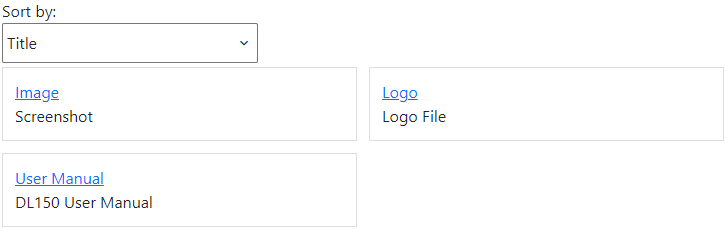
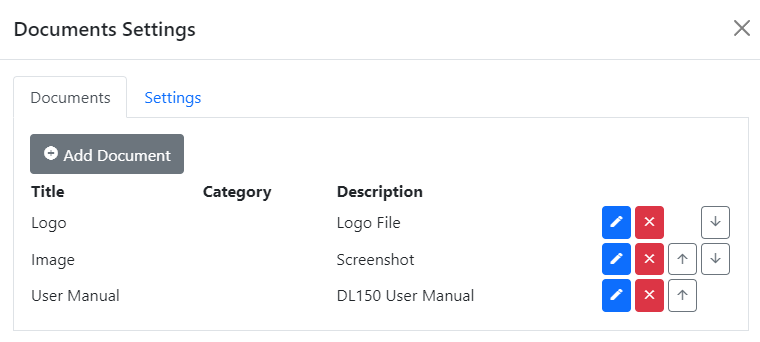
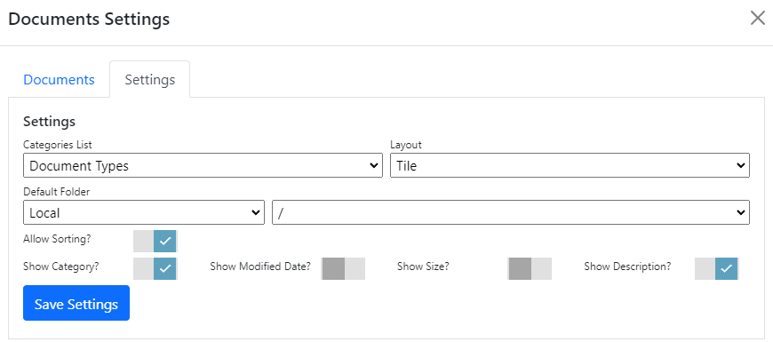
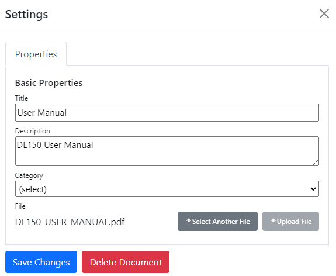

## Documents module
The documents module lists specified documents in a table or tile layout with optional sorting, categories and control over meta-data display.

To change settings for the module, click the `Settings` tab.

## Settings

{.table-25-75}
|                   |                                                                                      |
|-------------------|--------------------------------------------------------------------------------------|
| Categories List   | Specifies the list that is used by this module for categories.  If specified, users can assign a category from the list to documents, and users can sort by category. Lists are managed in the `Lists` editor in the `Manage` control panel. |
| Layout            | Documents can be displayed in a table, or as tiles in two columns.  |
| Default Folder    | You can assign a default folder which is selected automatically when you create a new document.  You can still choose files from other folders.  |
| Allow Sorting     | Specifies whether site users can sort the documents.  |
| Show Category     | Specifies whether to display the document category on-screen.  |
| Show Modified Date| Specifies whether to display the selected file's last modified date on-screen.  |
| Show Size         | Specifies whether to display the selected file's size on-screen.  |
| Show Description  | Specifies whether to display the document description on-screen.  |

To add a new document, click `Add Document`.  To edit an existing document, click the edit button to the right of the documents list.  You can 
also delete documents and change their default order.

## Document Properties
|                   |                                                                                      |
|-------------------|--------------------------------------------------------------------------------------|
| Title             | The document's title. This is shown on-screen. |
| Description       | The document description. This can be shown on-screen, depending on module settings.  |
| Allow Sorting     | Specifies whether site users can sort the documents.  |
| Category          | The document category. This can be shown on-screen, depending on module settings.  |
| File              | The document file.  You can assign an existing file or upload a new one.  |

