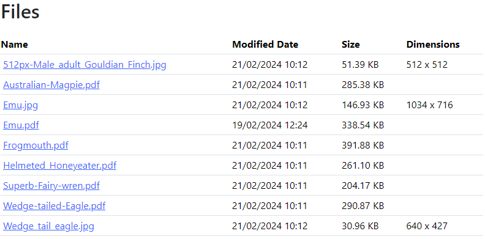
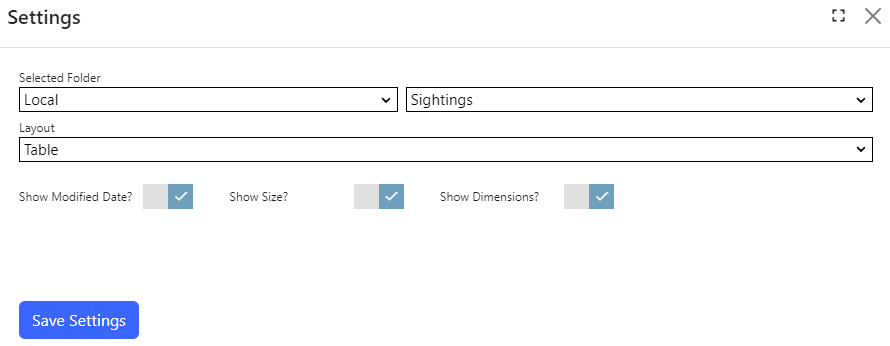

## Files List module
The files list module displays a list of downloadable files from a selected folder. Browsing permissions of the source folder is checked before displaying the list of files.

To change settings for the module, click the `Settings` tab.

## Settings

{.table-25-75}
|                   |                                                                                      |
|-------------------|--------------------------------------------------------------------------------------|
| Selected Folder   | Select a folder to display the list of files inside that folder.  |
| Layout            | Files can be displayed in a table, ordered list, unordered list or as tiles in two columns.  |
| Show Modified Date| Specifies whether to display the file's last modified date on-screen.  |
| Show Size         | Specifies whether to display the file's size on-screen.  |
| Show Dimensions   | Specifies whether to display the file dimensions on-screen. Dimensions are only applicable to valid image files. |

