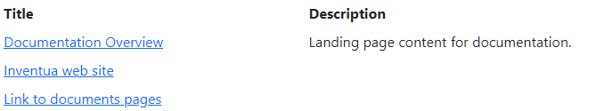
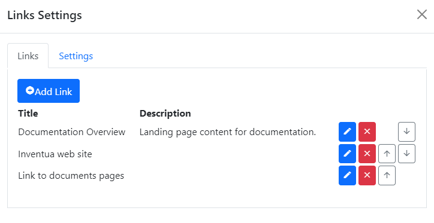
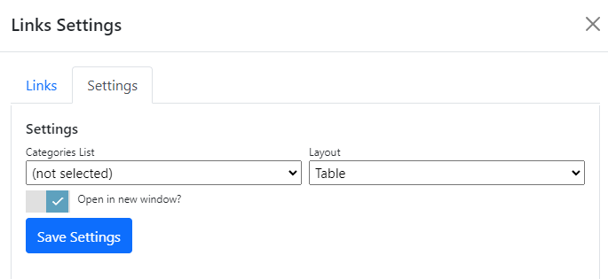
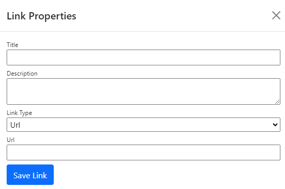

## Links module
The links module displays a lists of links to specified pages, files or Urls in a table or tile layout.

Any combination of links to files, pages and urls can be added to a links module.

To change settings for the module, click the `Settings` tab.

## Settings
|                   |                                                                                      |
|-------------------|--------------------------------------------------------------------------------------|
| Categories List   | Specifies the list that is used by this module for categories.  If specified, users can assign a category from the list to each link.  Lists are managed in the `Lists` editor in the `Manage` control panel. |
| Layout            | Links can be displayed in a table, or as an ordered or unordered list.  |
| Open in new window| Specifies whether to open links in the current window, or in a new window or tab (depending on your browser setup). |

To add a new link, click `Add Link`.  To edit an existing link, click the edit button to the right of the links list.  

## Link Properties
|                   |                                                                                      |
|-------------------|--------------------------------------------------------------------------------------|
| Title             | The link title is displayed on-screen. |
| Description       | The link description is displayed on-screen.  |
| Category          | The category is displayed on-screen, if selected.  The category property is not visible if you have not selected a category list in module settings.  |
| Link Type         | `Url`, `Page` or `File` |
| - Url             | If the link type is Url, enter the web site url to link to. |
| - Page            | If the link type is Page, select the target page. |
| - File            | If the link type is File, select the target file. |

> Permissions for Page and File links are checked at run time.  If the user does not have view permission for 
a linked page or file, the link is not displayed.