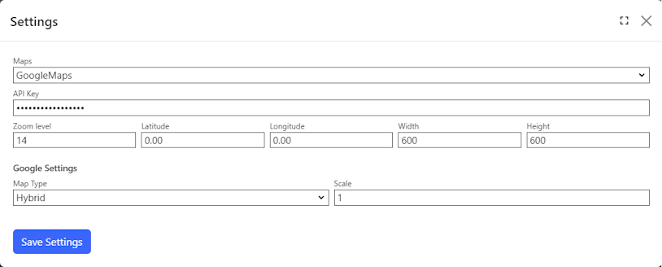

## Maps Module
The maps modules displays a static map determined by the latitude and longitude.

Users can select the map provider (Azure or Google) to use, control the size of the image and the level of zoom. 

Some settings are provider-specific.

For Azure, visit [Azure Maps Render client library](https://learn.microsoft.com/en-us/dotnet/api/overview/azure/maps.rendering-readme) for more information

For Google, visit [Google Maps Static API](https://developers.google.com/maps/documentation/maps-static/start) for more information on the settings.

## Settings

{.table-25-75}
|                        |                                                                                      |
|------------------------|--------------------------------------------------------------------------------------|
| API Key                | Your service API key. Get the API Key from the Azure Portal or Google Console. |
| Zoom Level             | Zoom level of the map. 
| Latitude               | Latitude coordinate value of the map. Based on the distance from the prime meridian (Greenwich Meridian). |
| Longitude              | Longitude coordinate value of the map. Based on the distance from the prime meridian (Greenwich Meridian). |
| Width                  | Horizontal dimension size of the map image. |
| Height                 | Vertical dimension size of the map image. |

### Azure maps
The `Azure Maps` settings provides an alternative authentication method to render a map image. The client id will only be used
if the API Key is not set.

{.table-25-75}
|                   |                                                                                      |
|-------------------|--------------------------------------------------------------------------------------|
| Client ID         | (Optional) Unique identifier used by the Azure Active Directory (AAD) authentication.   |

### Google maps
The `Google Maps` settings has additional settings for rendering a map image.

{.table-25-75}
|                   |                                                                                      |
|-------------------|--------------------------------------------------------------------------------------|
| Map Type          | (Optional) Type of rendered image. Selected values are roadmap (default), satellite, terrain and hybrid. |
| Scale             | (Optional) Resolution of the rendered image. Can be set to either 1 (default) or 2 (higher resolution). |

