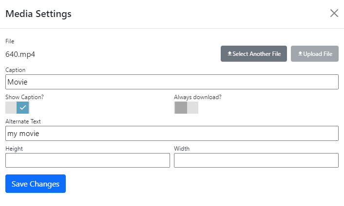

## Media module
The media module multimedia content on a page.  It can be used to show video, images, PDF documents within your page, and will render a download link for other file types.

## Settings
|                   |                                                                                      |
|-------------------|--------------------------------------------------------------------------------------|
| File              | Select the video, image, PDF or other file that you want to display.  |
| Caption           | Enter a caption to display for the media content.   |
| Show Caption      | Toggles whether to display the caption. |
| Always Download   | If selected, the always download setting causes the module to treat all files as "generic" and display the a caption, file size/modified data and a download link. |
| Alternate Text    | Specifies the title attribute (for video/pdf) or the alt attribute content for images.  |
| Height            | If specified, sets the rendered height for the embedded content.  You can specify height using any unit of measure permitted by CSS.  |
| Width             | If specified, sets the rendered width for the embedded content.  You can specify width using any unit of measure permitted by CSS.  |

> Permissions for the linked file are checked at run time.  If the user does not have view permission a 403-Forbidden response is returned along with the other page output (but the media module is not rendered).