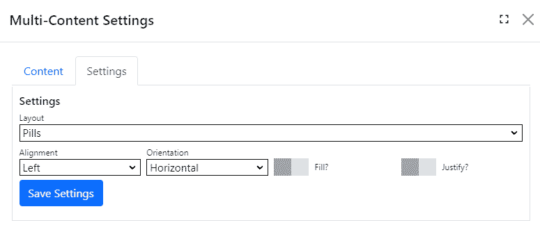

## Multi-Content module
The multi-content module displays content in an accordion, tab, pills, carousel or alert layout.  Use the multi-content module when you want multiple pieces of content to occuply the same space on a page.

> The Multi-Content module uses [Bootstrap components](https://getbootstrap.com/docs/5.0/components/accordion/) to render your content.

You can create multiple content items for the multi-content module.  Each item has a title and content.

Use the settings tab to control content presentation.

## Settings
|                   |                                                                                      |
|-------------------|--------------------------------------------------------------------------------------|
| Layout            | `Accordion`, `Alert`, `Carousel`, `Pills` or `Tabs`.  Each layout has its own set of options. |

### Accordion Layout
The `Accordion` layout displays one item at a time with a vertically stacked list of headings.  When the user chooses another item, the displayed item is hidden.

|                   |                                                                                      |
|-------------------|--------------------------------------------------------------------------------------|
| Open First        | Make the first item visible by default.   |
| Render Plain      | Draws the accordion without outer borders. |

### Alert Layout
The `Alert` layout displays all items in a highlighted container.  There are several alert styles to choose from.

|                   |                                                                                      |
|-------------------|--------------------------------------------------------------------------------------|
| Alert Style       | Alert colors.  These are [Bootstrap syles](https://getbootstrap.com/docs/5.1/components/alerts/).   |
| Show Close Button | Includes a close button at the top-right of the alert, which the user can click to close the alert. |

> The `Alert` layout doesn't display your content items in the same space like the other layouts.

### Carousel Layout
The `Carousel` layout cycles through your content items automatically.

|                   |                                                                                      |
|-------------------|--------------------------------------------------------------------------------------|
| Show Controls     | Toggles whether to display forward/back controls to the user.  The carousel transitions through content items automatically, unless the user hovers the mouse over the display.   |
| Show Indicators   | Toggles whether to display an indicator showing the carousel's progress through the set of content items. |
| Render Plain      | Render the accordion without a background color, rounded corners so that it is rendered edge-to-edge with the parent container. |

### Tabs and Pills Layout
The `Tabs` layout draws multiple content items with navigation elements for the user to select which tab is visible. 
The `Pills` layout is similar to tabs, but doesn't have borders on the navigation elements.

|                   |                                                                                      |
|-------------------|--------------------------------------------------------------------------------------|
| Alignment         | Specifies the navigation element alignment (`Left`, `Center`, or `Right`).   |
| Orientation       | Specifies whether navigation elements are shown side-by-side (horizontal) or in a column (vertical). |
| Fill              | Specifies whether navigation elements should stretch to fill the available space. |
| Justify           | Specifies that navigation elements should all be the same width.  |
