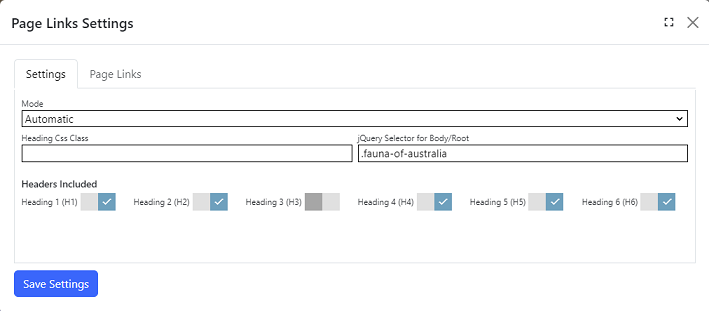

## Page Links module
The page links module displays header links of another module to navigate to a section on a page.  In Automatic mode, the page links
are generated based on the settings.

## Settings

{.table-25-75}
|                               |                                                                                      |
|-------------------------------|--------------------------------------------------------------------------------------|
| Mode                          | Select Automatic or Manual mode.  |
| Heading Css Class             | Include only header elements which have one or more of the specified css classes, separate multiple classes with a comma. Automatic mode only.  |
| jQuery Selector for Body/Root | jQuery Selector as the root used to detect headers. Automatic mode only.  |
| Headers Included              | Select the type of headers to be included.  Automatic mode only |

The Heading Css Class and jQuery Selector settings can be used separately or in combination to match the valid headers to display as a page link. 
Refer to https://api.jquery.com/category/selectors/ to view the syntax.  Most commonly used selectors are the ID selector (prefix `#` and value of the id attribute)
and the Class selector (prefix `.` and the value of the class attribute).

## Page Links Properties

{.table-25-75}
|                   |                                                                                             |
|-------------------|---------------------------------------------------------------------------------------------|
| Target Id         | The page link used to navigate to the section on the same page. Also known as a jump link.  |
| Title             | Enter the title to be displayed for the anchor link.  |

To add a link, click `Add Page Link`.  To edit an existing page link, make the changes in the textbox and click on `Save Settings`.  You can 
also delete page links and change their default order.
