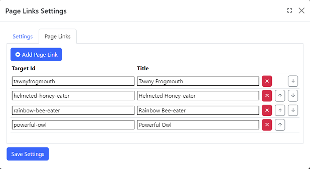

## Page Links module
The page links module displays a list of links which are used to navigate to elements in the current page.  In Automatic mode, page links
are generated dynamically based on page content, and in manual mode, you specify exactly which links to display.

## Settings

{.table-25-75}
|                               |                                                                                      |
|-------------------------------|--------------------------------------------------------------------------------------|
| Mode                          | Select Automatic or Manual mode.  |
| Heading Css Class             | Include only header elements which have one or more of the specified css classes, separate multiple classes with a comma. Automatic mode only.  |
| jQuery Selector for Body/Root | jQuery Selector as the root used to detect headers. Automatic mode only.  |
| Headers Included              | Select the type of headers to be included.  Automatic mode only |

The Heading Css Class and jQuery Selector settings can be used separately or in combination to match the valid headers to display as a page link. 
Refer to https://api.jquery.com/category/selectors/ to view the syntax.  The most commonly used selectors are the ID selector (prefix `#` followed by the value of an element's id attribute)
and the class selector (prefix `.` followed by a CSS class name).

## Page Links Properties

{.table-25-75}
|                   |                                                                                             |
|-------------------|---------------------------------------------------------------------------------------------|
| Target Id         | An element ID or CSS class name used to navigate to an element on the same page. If the value does not start with `#` or `.`, a `#` is automatically added at run time.  |
| Title             | The text to be displayed for the link.  |

To add a link, click `Add Page Link`.  To edit an existing page link, make the changes in the textbox and click on `Save Settings`.  You can 
also delete page links and change their sort order using the buttons on the right.
