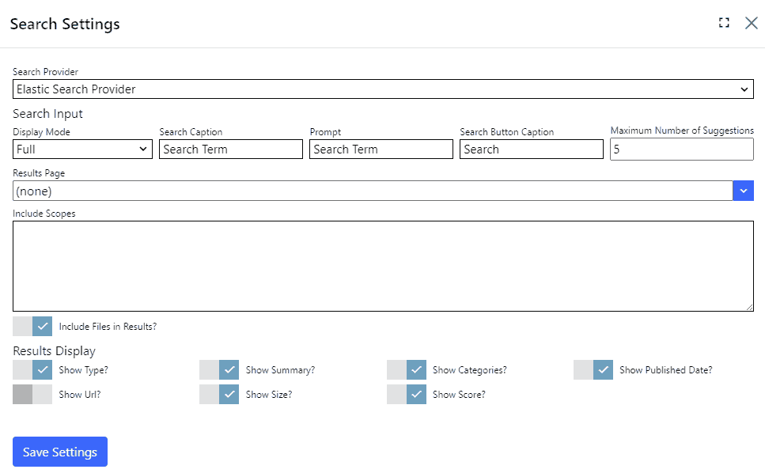

## Search module
The search module lists provides a user interface for searching your site.  As your users type a search term, a "quick results" display shows 
the titles of search terms which match your search term.  The user clicks a result to open the page, file or other resource from your site.  

Users can click `Search` to display results in full.

> The search module doesn't work on its own.  You need to install a search provider for the search module to use to get search results.  

> Search providers are installed separately.  The Elastic Search extension includes both a search provider and a search index 
manager to populate the search index.  Some search providers may include only a search provider, or only a search index manager.

You can control the presentation of the full results display in the module settings page.

## Settings

{.table-25-75}
|                     |                                                                                      |
|---------------------|--------------------------------------------------------------------------------------|
| Display Mode                   | Specifies how the search module is displayed. Available settings are Full, Compact and Minimal.  |
| Search Caption                 | Specifies the label displayed next to the search term text box.  This is only displayed when display mode is 'Full'. |
| Search Button Caption          | Specifies the text of the seach button.  The search button is not displayed when display mode is 'Minimal'. |
| Maximum number of suggestions  | Specifies the number of search suggestions to display as the user types their search term. |
| Results Page                   | Specifies the page to navigate to when the user clicks the search button or presses ENTER.  This page should contain a search module.  Select (none) to display results on the same page as the search module. |
| Include Scopes                 | Use this setting to restrict results to specified scopes, or leave blank to return results from all sources (this is the default).  Specify included scopes by entering one or more scopes separated by line feeds.  A scope is the URN of the data type which was used to create a search entry (Examples: site pages - urn:nucleus:entities:page, files - urn:nucleus:entities:file, forum posts - urn:nucleus:entities:forum-post).  This setting affects both search suggestions and search results.  This is an advanced setting which may not be supported by all search providers. |
| Include Files in Results       | Specifies whether to include files in search results. |
| Show Categories                | Toggles whether to display categories (if the search result has any) in the full results display. |
| Show Published Date            | Toggles whether to display the published date (if one applies to the result) in the full results display. |
| Show Size                      | Toggles whether to display the result size in the full results display. |
| Show Score                     | Toggles whether to display the result score in the full results display. |

> For search providers which support it, the result score is based on how well a specific result matches your search term, relative to all of 
the results in the index. 