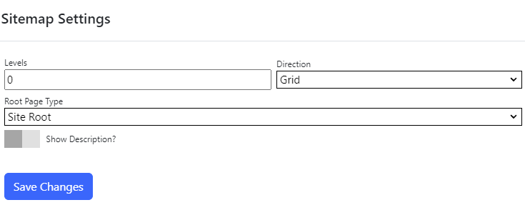

## Site map module
The site map module displays a list of pages within your site.  It can be used as a full site map for users, as a side-menu, or to 
display a list of pages in on a landing page. 

## Settings

{.table-25-75}
|                     |                                                                                      |
|---------------------|--------------------------------------------------------------------------------------|
| Levels              | Specifies how many levels of descendant pages to display.  Set to 0 to show all levels.  |
| Root Page Type      | Specifies how to determine the top level page (see below). |
| Selected Page       | If the root page type is set to `Selected Page`, specifies the selected page. |
| Show Description    | Specifies whether to display the page description. |

### Root Page Types

{.table-25-75}
|                     |                                                                                      |
|---------------------|--------------------------------------------------------------------------------------|
| Site Root           | Start from the root of the site (pages with no parent set).  |
| Selected Page       | Display pages starting from the selected page.  |
| Home Page           | Display pages starting from the site's home page.  |
| Current Page        | Display pages starting with the children of the current page.  |
| Parent Page         | Display pages starting with the current page's parent.  |
| Top Ancestor        | Display pages starting with the top ancestor of the current page (the ancestor with no parent page set) .  |
| Dual                | If the current page has a parent, use the same behaviour as `Current Page`.  If the current page does not have a parent, use the same behavior as `Top Ancestor`.  |

> If you are using the site map module to render a full site map, set `Levels` to 0, and Root Page type to `Site Root`.

> If you are using the site map module to render a landing page, set `Levels` to 1, Root Page type to `Current Page` and `Show Description` to on.