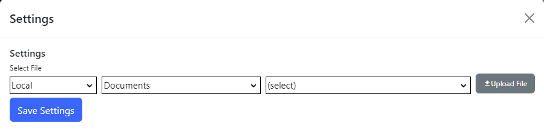

## Static Content module
The Static Content module displays static content files inline in markdown, html or text file format, and can serve other supported file types as
regular HTTP responses.  You can use the static content module to publish individual files, or you can publish a set of files - relative hyperlinks 
and relative links to other files like image files are supported. 

First, use the [File Manager](/files-and-folders/) to create folders and upload your static files.  Then, in the module settings for the static 
content module, select your file system provider, folder and the default file to display.  If your static content contains relative links or 
image tags with a relative path, they will work within the static content module.

> The static content module checks that the user has view permissions for files being displayed, so make sure that your folder permissions are set.  If 
a user visits a page with a static content module and does not have view permission, no content will be displayed.

The Static Content manager uses the Nucleus Extensions [ContentExtensions.ToHtml](https://www.nucleus-cms.com/api-documentation/Nucleus.Extensions.ContentExtensions/#mnu-Nucleus-Extensions-ContentExtensions#ToHtml(String,String))
method to convert Markdown and Text files to Html.

### Markdown
Nucleus uses the [MarkDig](https://github.com/xoofx/markdig) processor to convert Markdown to Html.  

### Text Files
Text files are written to HTML as-is, except that all combinations of carriage return/line feeds are converted to ` ` elements.

The Html output is checked for ``, `<script>` and `<link>` tags.  If they are links to files within your file system, they are converted to 
Nucleus ==File== links in order to avoid a redirect and improve performance.
