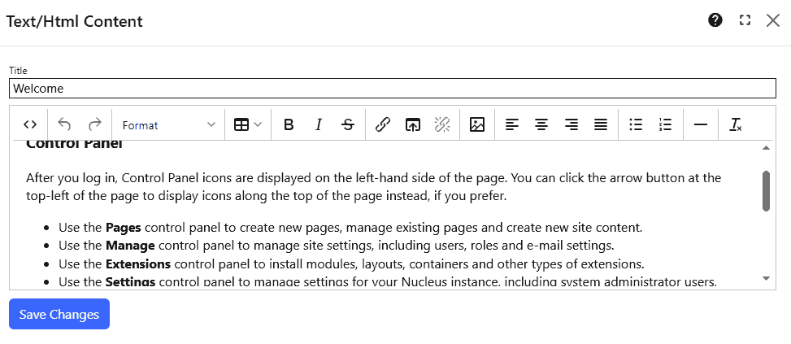

## Text/HTML module
The Text/HTML module displays HTML or text content.  

The editor is similar to other rich text editors.  You can set formatting, bold/italic, insert links to other web sites, page links and image 
links, and add lists.  If you need to edit Html content directly, click the `<>` button.

### Functions

{.table-25-75}
|                  |                                                                                      |
|------------------|--------------------------------------------------------------------------------------|
| Edit Source      | Open the current content in a popup window where you can edit the HTML source.   |
| Undo             | Undo the most recent operation.                                                  |
| Redo             | Redo the most recent "undo".                                                     |
| Format           | Turn the current selection into a heading, preformatted text, code block or marked text. |
| Table            | Insert a table, or change the settings of an existing table.                     |
| Bold             | Apply bold formatting to the current selection.                                  |
| Italic           | Apply italic formatting to the current selection.                                |
| Strikethrough    | Apply stikethrough formatting to the current selection.                          |
| Insert Link      | Insert a link to an Url, or change the settings of an existing link.             |
| Insert Page Link | Insert a link to another page in your site. A popup dialog is displayed so that you can select a page.  |
| Remove Link      | Remove the selected link                                                         |
| Insert Image     | Insert an image from your site. A popup dialog is displayed so that you can select one of your site images.   |
| Align Left       | Align the current selection to the left.                                         |
| Center           | Center the current selection.                                                    |
| Align Right      | Align the current selection to the right.                                        |
| Justify          | Stretch the current selection so that each line has equal width.                 | 
| Bullet List      | Insert a new bullet list, or convert the selection to a list.                    |
| Numbered List    | Insert a numbered list, or convert the selection to a list.                      |
| Horizontal Line  | Insert a horizontal line.                                                        |
| Clear Formatting | Remove all formatting from the selection.                                        |

