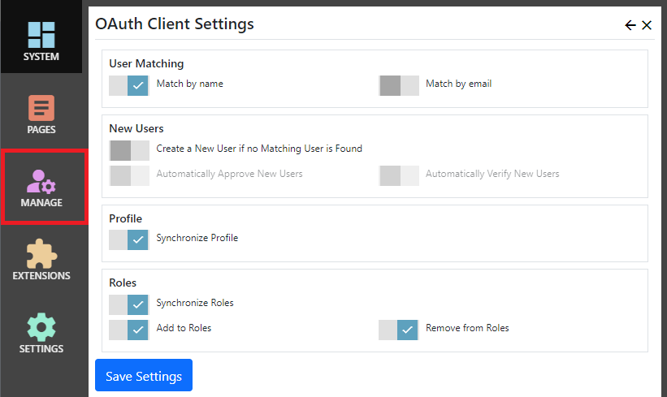

## OAuth client
The OAuth client allows users to sign on to Nucleus using an external OAuth2 service. 

> An [OAuth server extension](other-extensions/oauth-server) for Nucleus is available for sale. 

> Most OAuth services use SSL (https).  The Microsoft remote authentication system uses a 'correlation cookie' to track remote login requests. 
Modern browsers block cookies when navigating from an SSL to non-SSL site.  Therefore, if you are using an OAuth service you should use SSL for
your site, because browsers will block the correlation cookie unless both the OAuth client site and OAuth service site use SSL.

The OAuth client extension settings are accessed in the `Manage` control panel.  OAuth providers are set up in configuration files.



## Settings

{.table-25-75}
|                           |                                                                                      |
|---------------------------|--------------------------------------------------------------------------------------|
| User Matching             | |
| - Match by name           | When an user signs in using OAuth, look for their Nucleus user record using the user name sent by the OAuth service. |
| - Match by email          | When an user signs in using OAuth, look for their Nucleus user record using the email address sent by the OAuth service.  If both the match by name and match by email settings are enabled, matching by email only takes place if no user with a matching user name was found.  If the email address matches more than one user, no user is matched. |
| New Users                 |  |
|  - Create a New User if no Matching User is Found  | Create a new user if a Nucleus user account does not already exist.  If this setting is set to OFF and a user tries to log in and doesn't have an existing Nucleus account, they are redirected to the login page with an 'Access Denied' message.   |
|  - Automatically Approve New Users                 | When a new user is created, automatically mark the user account as approved.  If this setting is set to OFF, the user can still log in, but will not have access to any restricted functions until a site administrator approves their account. |
|  - Automatically Verify New Users                  | When a new user is created, automatically mark the user account as verified.  If this setting is set to OFF, the user can still log in, but will not have access to any restricted functions until they verify their email address by clicking a link in an email which was sent automatically when their account was created. |
| Profile                   |    |
|  - Synchronize Profile     | Updates user profile information with data sent by the OAuth service.  |
| Roles                      |  |
|  - Synchronize Roles       | Enables role synchronization using data sent by the OAuth service.  One or both of the add/remove settings must be enabled.  This function only works if the OAuth service sends role information.  Most public OAuth services like Facebook, Google and Twitter do not send roles.  The Nucleus OAuth server extension sends role information.  |
|  - Add To Roles            | Adds the user to all roles sent by the OAuth service, if a matching role name is found in Nucleus. |
|  - Remove from Roles       | Removes the user from all roles that were NOT sent by the OAuth service. |

> Use the "Remove from Roles" option with caution.  This option is intended for site operators who control a number of sites with a shared user base, and who want to implement OAuth for single sign-on (SSO). 

## OAuth Providers List Module
The `OAuth Providers List` module displays a clickable list of available OAuth providers, and is intended for use on your site's login page.  You can also add it to other 
pages.

### Settings

{.table-25-75}
|                           |                                                                                      |
|---------------------------|--------------------------------------------------------------------------------------|
| Layout                                 | Available OAuth providers can be displayed in a list with clickable links, or in a drop-down with a Login button. |
| Automatically redirect to remote login | If you only have one OAuth provider configured, you can set the module to automatically redirect to that OAuth provider's login page automatically. If you have more than one OAuth provider configured, this setting has no effect. |

> You can choose not to use the OAuth Providers List module and include a link to your OAuth provider in your page layout, or in the content of another module.  The Url to 
start remote authentication is `https://your-site/extensions/oauthclient/authenticate/providerName`, where providerName is the name of an entry in your configuration file, or is the type of an 
OAuth provider entry which does not have a name.

## Configuration
OAuth providers are configured in the Nucleus:OAuthProviders section in a .json configuration file.  This is typically appSettings.[environment].json, but you can use a
[different file](/configuration-files/) if you want to.

> The Google, Facebook, Twitter and Microsoft Account services have pre-configued default settings, so you only need to configure the client id and client secret that you generate using the 
OAuth service's web site tools.  [Click here](https://docs.microsoft.com/en-us/aspnet/core/security/authentication/social#setup-login-providers-required-by-your-application)
for instructions on how to use their web sites to generate client credentials.  Most OAuth services need for you to enter your Redirect URI, which is 
`https://your-site/extensions/oauthclient/callback/providerName`, where providerName is the name of an entry in your configuration file, or is the type of an 
OAuth provider entry which does not have a name.

> The Twitter OAuth2 service does not return the user's email address.  If you need the user's email address, don't allow users to login using Twitter.

> The Nucleus OAuth Server example above uses the generic `OAuth` provider, which can also be used to use other OAuth services.

### Configuration Settings

{.table-25-75}
|                         |                                                                                      |
|-------------------------|--------------------------------------------------------------------------------------|
| Type                    | (required). Specifies the provider type.  Must be Google, Facebook, Twitter, Microsoft, OAuth or OpenIdConnect. |
| Name                    | (optional). This is the key value used in Urls which reference this provider.  If you are using the Google, Facebook, Twitter or Microsoft service you can omit the `Name` setting and the `Type` will be used instead.|
| FriendlyName            | (optional). This is the on-screen name used by the `OAuth Provider List` module.  If you do not specify a friendly name, the Name or Type is used instead.|
| ClientId                | (required). Client Id issued by the OAuth2 service. |
| ClientSecret            | (required). Client Secret issued by the OAuth2 service.  If you do not have a client secret, set the value to an empty string. |

You do not need to specify Endpoints if you are using Google, Facebook, Twitter or Microsoft OAuth. 

{.table-25-75}
|                         |                                                                                      |
|-------------------------|--------------------------------------------------------------------------------------|
| AuthorizationEndpoint   | This is the endpoint (url) for the OAuth2 `Authorize` request.  |
| TokenEndpoint           | This is the endpoint (url) for the OAuth2 `Token` request. |
| UserInformationEndpoint | This is the endpoint (url) used to retrieve user information after a successful OAuth2 authorization.  If your OAuth service returns user information from the `Token` endpoint in a JWT token, the UserInformationEndpoint is not used.  |
|                         |  |
| MapJsonKeys             | (optional). The MapJsonKeys is a list of one or more entries which tell the OAuth client how to interpret values which are returned by the UserInformationEndpoint or a JWT token returned by the OAuth service.  You must add an entry for each claim type that you want the OAuth client to consume.  |
| - claimtype             | (required). A claim type uri.  There is a special claim type for the user name `http://schemas.xmlsoap.org/ws/2005/05/identity/claims/name` which you will typically want to include.  |
| - jsonKey               | (optional). Many OAuth services use their own property names for user values.  Use `jsonKey` to specify the OAuth service property name to map to your claim type. |

> Claim types are matched with your site's user profile properties `Type Uri` to populate user profile values.  The `http://schemas.microsoft.com/ws/2008/06/identity/claims/role` claim type 
represents roles, and you will need a `MapJsonKeys` entry for it if you want to synchronize roles.

## Example

```
"Nucleus":
"OAuthProviders": 
[
  {
    "Type": "Google",
    "ClientId": "your-clientid-here",
    "ClientSecret": "your-secret-here"
  },
  {
    "Type": "Facebook",
    "ClientId": "your-clientid-here",
    "ClientSecret": "your-secret-here"
  },
  {
    "Type": "OAuth",
    "Name": "Nucleus OAuth Server",
    "FriendlyName": "My Nucleus OAuth Server",
    "AuthorizationEndpoint": "https://site-url/oauth2/authorize",
    "TokenEndpoint": "https://site-url/oauth2/token",
    "UserInformationEndpoint": "https://site-url/oauth2/userinfo",
    "ClientId": "your-clientid-here",
    "ClientSecret": "none",
    "MapJsonKeys": [
      { "claimtype": "http://schemas.xmlsoap.org/ws/2005/05/identity/claims/name" },
      { "claimtype": "http://schemas.xmlsoap.org/ws/2005/05/identity/claims/givenname" },
      { "claimtype": "http://schemas.xmlsoap.org/ws/2005/05/identity/claims/surname" },
      { "claimtype": "http://schemas.xmlsoap.org/ws/2005/05/identity/claims/nameidentifier" },
      { "claimtype": "http://schemas.xmlsoap.org/ws/2005/05/identity/claims/emailaddress" },
      { "claimtype": "http://schemas.microsoft.com/ws/2008/06/identity/claims/role" }
    ],
    "Scope": [ "OAuth2" ]
  },
  {
    "Type": "OAuth",
    "Name": "Some other Server",
    "FriendlyName": "My Nucleus OAuth Server",
    "AuthorizationEndpoint": "https://site-url/oauth2/authorize",
    "TokenEndpoint": "https://site-url/oauth2/token",
    "UserInformationEndpoint": "https://site-url/oauth2/userinfo",
    "ClientId": "your-clientid-here",
    "ClientSecret": "your-secret-here",
    "MapJsonKeys": [
      { "claimtype": "http://schemas.xmlsoap.org/ws/2005/05/identity/claims/name", "jsonKey": "user.name" },
      { "claimtype": "http://schemas.xmlsoap.org/ws/2005/05/identity/claims/givenname", "jsonKey": "user.firstname" },
      { "claimtype": "http://schemas.xmlsoap.org/ws/2005/05/identity/claims/surname", "jsonKey": "user.lastname" },
      { "claimtype": "http://schemas.xmlsoap.org/ws/2005/05/identity/claims/nameidentifier", "jsonKey": "user.username" },
      { "claimtype": "http://schemas.xmlsoap.org/ws/2005/05/identity/claims/emailaddress", "jsonKey": "user.email" },
      { "claimtype": "http://schemas.microsoft.com/ws/2008/06/identity/claims/role", "jsonKey": "user.roles" }
    ],
    "Scope": [ "OAuth2" ]
  }
]
```
