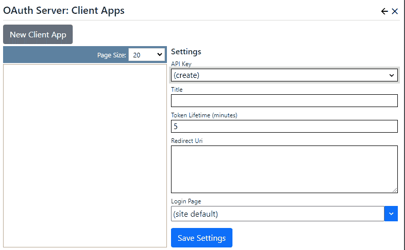

## OAuth server
The OAuth server extension provides an OAuth2 implementation to provide authentication (single-signon) services to other web sites 
and applications.  Users can use their Nucleus credentials to access web sites which are configured to use Nucleus as their OAuth2 
identity provider.

> There is a free [OAUTH client extension](/other-extensions/oauth-client) for Nucleus.  Your OAUTH client (Service Provider) can also be any other 
software which supports OAUTH2.

> Most OAuth services use SSL (https).  The Microsoft remote authentication system uses a 'correlation cookie' to track remote login requests. 
Modern browsers block cookies when navigating from an SSL to non-SSL site.  Most OAuth providers use SSL, so you should use SSL for
your site, because browsers will block the correlation cookie unless both the OAuth client site and OAuth provider site use SSL.

## OAuth Overview
You will configure a Client App for each calling application (see below), and will provide them with the following information:

{.table-25-75}
|                           |                                                                                      |
|---------------------------|--------------------------------------------------------------------------------------|
| AuthorizationEndpoint     | https://[your-site-url]/oauth2/authorize |
| TokenEndpoint             | https://[your-site-url]/oauth2/token |
| UserInformationEndpoint   | https://[your-site-url]/oauth2/userinfo |
| ClientId                  | This is the "API Key" from the Client App (see below). |
| Scope                     | OAuth2 |

The operator of the calling application will need to supply you with their OAUTH Redirect Uri (see below).

> There is a Nucleus [SAML server extension](other-extensions/saml-server) available.  SAML is often used in enterprise environments.  OAuth2 
is a more straightforward protocol than SAML for providing single-signon (SSO) to other web sites.  

## Settings
For each application that will be using your OAUTH Identity Provider, you must create a "Client App", which 
has configuration settings which are specific to each client application.

The OAuth server extension settings are accessed in the `Manage` control panel. 

{.table-25-75}
|                           |                                                                                      |
|---------------------------|--------------------------------------------------------------------------------------|
| API Key                   | Select an existing API Key, or select the "create" option to create a new key.       |
| Title                     | The Client App title is for your reference only. |
| Token Lifetime            | Specifies the token expiry, in minutes.  The token is used to store data which is used when returning from the login page, and when OAuth calls to retrieve user data.  The token lifetime should be short, but long enough for a user to log in and complete the authentication process.  Default: 5 minutes.   |
| Redirect Uri              | This is the Uri that your browser is redirected to after a successful login.  It is supplied by the operator of the calling site.  |
| Login Page                | (optional)  Specifies an alternative login page to use for authentication.  An alternative page can contain content which is specific to a particular client.  The page should contain a login module.  |

## Scheduled Task
The OAUTH server extension includes a scheduled task which must be configured in the `Settings` control panel.  The scheduled task 
deletes expired client app tokens from the database.  The suggested settings are: 

{.table-25-75}
|                                   |                                                                                      |
|-----------------------------------|--------------------------------------------------------------------------------------|
| Name                              | Remove Expired OAUTH Tokens                       |
| Task                              | Nucleus OAUTH Server: Clean up Expired Tokens     |
| Enabled                           | Yes                                               |
| Interval                          | 2 Hours                                           |
| Instance Type                     | Per Instance                                      |
| Keep History                      | 10                                                |

> You may choose to reduce the scheduled task interval to as little as 5 minutes if your server is processing a lot of authentication requests.
