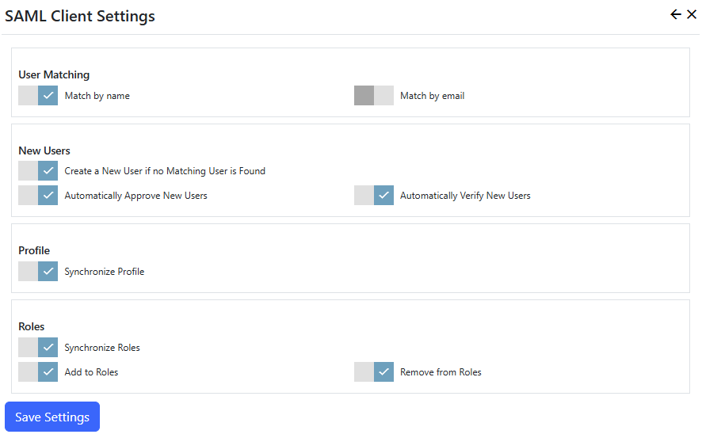

## SAML client
The SAML client allows users to sign on to Nucleus using an external SAML2 service (Identity Provider). 

> A SAML server extension for Nucleus is available for sale. 

The SAML client extension settings are accessed in the `Manage` control panel. 



## Settings

{.table-25-75}
|                           |                                                                                      |
|---------------------------|--------------------------------------------------------------------------------------|
| User Matching             | |
| - Match by name           | When an user signs in using SAML, look for their Nucleus user record using the user name sent by the SAML service. |
| - Match by email          | When an user signs in using SAML, look for their Nucleus user record using the email address sent by the SAML service.  If both the match by name and match by email settings are enabled, matching by email only takes place if no user with a matching user name was found.  If the email address matches more than one user, no user is matched. |
| New Users                 |  |
|  - Create a New User if no Matching User is Found  | Create a new user if a Nucleus user account does not already exist.  If this setting is set to OFF and a user tries to log in and doesn't have an existing Nucleus account, they are redirected to the login page with an 'Access Denied' message.   |
|  - Automatically Approve New Users                 | When a new user is created, automatically mark the user account as approved.  If this setting is set to OFF, the user can still log in, but will not have access to any restricted functions until a site administrator approves their account. |
|  - Automatically Verify New Users                  | When a new user is created, automatically mark the user account as verified.  If this setting is set to OFF, the user can still log in, but will not have access to any restricted functions until they verify their email address by clicking a link in an email which was sent automatically when their account was created. |
| Profile                   |    |
|  - Synchronize Profile     | Updates user profile information with data sent by the SAML service.  |
| Roles                      |  |
|  - Synchronize Roles       | Enables role synchronization using data sent by the SAML service.  One or both of the add/remove settings must be enabled.  This function only works if the SAML service sends role information.  Most public SAML services like Facebook, Google and Twitter do not send roles.  The Nucleus SAML server extension sends role information.  |
|  - Add To Roles            | Adds the user to all roles sent by the SAML service, if a matching role name is found in Nucleus. |
|  - Remove from Roles       | Removes the user from all roles that were NOT sent by the SAML service. |

> Use the "Remove from Roles" option with caution.  This option is intended for site operators who control a number of sites with a shared user base, and who want to implement SAML for single sign-on (SSO). 

## Configuration
SAML2 Identity providers are configured in a .json configuration file.  This is typically appSettings.Production.json or appSettings.Development.json, but you can use a
[different file](/configuration-files/) if you want to.  Identity Provider settings are in the Nucleus:SAMLProviders section.  

{.table-25-75}
|                                          |                                                                                      |
|------------------------------------------|--------------------------------------------------------------------------------------|
| Key                                      | Unique key for the Identity provider.  This value is used to identity which Identity Provider to use in SP endpoints (see below).  |
| FriendlyName                             | On-screen name for the Identity provider. |
| Issuer                                   | Service Provider Issuer name.  This is normally set to the domain name of the Service Provider application. |
| AllowedIssuer                            | Authorization Response allowed issuer value.  This must match the value which is specified by your SAML Identity Provider. |
| ResponseProtocolBinding                  | Specifies the requested response binding.  "urn:oasis:names:tc:SAML:2.0:bindings:HTTP-Artifact", or "urn:oasis:names:tc:SAML:2.0:bindings:HTTP-POST" | 
| IdPMetadataUrl                           | IdP metadata url (optional).  If this is specified correctly, most of the settings below are not required.  If other settings are specified in addition to IdPMetadataUrl, they are overridden by settings from the IdP meta-data.|
|   |
| SignAuthnRequest                         | Specifies whether to sign Authorization Requests.  The default value is "true". |
| SignMetadata                             | Specifies whether to sign SP Metadata responses.  The default value is "true". |
| SigningCertificateFile                   | The filename of a certificate which contains a private key, used to sign authorization requests.  This file typically has a .pfx extension. Specify this value or SigningCertificateFileThumbprint, but not both.    |
| SigningCertificateFileThumbprint         | The thumbprint of a certificate which contains a private key, used to sign authorization requests.  The certificate must be installed in the "Local Computer/My" certificate store. |
| SigningCertificatePassword               | If your signing certificate has a password, specify a non-blank value for SigningCertificatePassword.  This value is only used when loading the certificate from a file. |
| SignatureAlgorithm                       | Specify the algorithm used when signing requests.  The default value is http://www.w3.org/2001/04/xmldsig-more#rsa-sha256, and you should only change the value if your Identity Provider supports it. |
| SignatureValidationCertificateFile       | The filename of a certificate which does not contain a private key, used to validate authorization responses from the Identity Provider.  This file is supplied to you by your Identity Provider.  This file typically has a .cer extension. Specify this value or SignatureValidationCertificateThumbprint, but not both.|
| SignatureValidationCertificateThumbprint | The thumbprint of a certificate which does not contain a private key, used to validate authorization responses from the Identity Provider.  The certificate must be installed in the "Local Computer/My" certificate store. |
| ArtifactResolutionServiceUrl             | The endpoint Url for the Identity Provider's Artifact Resolution Service.  This is only required if you specify HTTP-Artifact binding in the ResponseProtocolBinding option and have not specified an IdPMetadataUrl. |
| SingleSignOnDestination                  | The Url of the SingleSignon endpoint.  This value is supplied by your Identity Provider.  This value is not required if you have specified IdPMetadataUrl. |
| SingleLogoutDestination                  | The Url of the SingleLogout endpoint.  This value is supplied by your Identity Provider.  This value is not required if you have specified IdPMetadataUrl. |
|   |
| MapClaims                                | A list of claims mappings.  These are required even if you have specified IdPMetadataUrl.  |
| - claimType                              | Nucleus claim type.  These match the values in your site's profile properties which are configured in the Manage/Site page. |
| - samlKey                                | Identity provider keys.  These are supplied by your Identity Provider.  |


### Sample
```
"Nucleus":
"SAMLProviders": 
[
  {
    // SAML provider key
    "Key": "nucleus-test",
    // on-screen name
    "FriendlyName": "Nucleus test",
    // AuthnRequest issuer.  This is optional, but note that the Nucleus SAML server always requires
    // an issuer, as do many others. IdP metadata does not supply this value.
    "Issuer": "my-site.com",
    // IdP metadata url (optional).  If this is specified correctly, most of the other settings are 
    // not required.  If other settings are specified in addition to IdPMetadataUrl, they are 
    // overridden by settings from the IdP meta-data.
    "IdPMetadataUrl": "https://identity-provider-url/saml2/idp/metadata/my-site.com",
    // AuthnResponse allowed issuer
    "AllowedIssuer": "service-provider-domain-name",
    // Property of AuthnRequest, specifies binding to use for AuthnResponse
    "ResponseProtocolBinding": "urn:oasis:names:tc:SAML:2.0:bindings:HTTP-Artifact", 
    // - "ResponseProtocolBinding" can also be urn:oasis:names:tc:SAML:2.0:bindings:HTTP-POST
    // return url
    "ArtifactResolutionServiceUrl": "https://identity-provider-url/saml2/idp/artifact",
    // Specifies whether to sign the AuthnRequest
    "SignAuthnRequest": "true",
    // Specifies whether to sign metadata
    "SignMetadata": "true",
    // Signature used to sign the AuthnRequest, if SignAuthnRequest is true.  This certificate should 
    // include a private key and can have a password.
    "SigningCertificateFile": "C:\Certificates\sp-certificate-with-private-key.pfx",
    // Either SigningCertificateFile OR SigningCertificateThumbprint should be specified, but not both
    // "SigningCertificateFileThumbprint": "A1234567890",
    // Password for the AuthnRequest.  Omit or set to an empty string for no password
    "SigningCertificatePassword": "my-cert-password",
    // Signature algorithm for signed AuthnRequest.  
    "SignatureAlgorithm": "http://www.w3.org/2001/04/xmldsig-more#rsa-sha256",
    // certificate used to validate AuthnResponse.  This signature should NOT include a private key, 
    // and can not have a password.
    "SignatureValidationCertificateFile": "C:\Certificates\\idp-certificate-no-private-key.cer",
    // Either SignatureValidationCertificateFile OR SignatureValidationCertificateThumbprint should 
    // be specified, but not both
    // "SignatureValidationCertificateThumbprint": "A1234567890",
    // Identity provider (IdP) sign on endpoint
    "SingleSignOnDestination": "https://identity-provider-url/saml2/idp/login",
    // Identity provider (IdP) logout endpoint
    "SingleLogoutDestination": "https://identity-provider-url/saml2/idp/logout",
    // List of claims mappings, used to map assertion values to service provider (SP) claims.  samlKey 
    // is the value returned by the identity provider.  claimType is the value used by the service 
    // provider (Nucleus).  In this example, most of the assertion attributes returned by the Identity 
    // Provider are the same as the Service Provider, but that won't always be the case.  Any assertion
    // attributes that are returned by the Identity Provider which are not included in the MapClaims 
    // section are ignored.
    "MapClaims": 
    [
      {
        "claimtype": "http://schemas.xmlsoap.org/ws/2005/05/identity/claims/nameidentifier",
        "samlKey": "http://schemas.xmlsoap.org/ws/2005/05/identity/claims/name"
      },
      {
        "claimtype": "http://schemas.xmlsoap.org/ws/2005/05/identity/claims/name",
        "samlKey": "http://schemas.xmlsoap.org/ws/2005/05/identity/claims/name"
      },
      {
        "claimtype": "http://schemas.xmlsoap.org/ws/2005/05/identity/claims/givenname",
        "samlKey": "http://schemas.xmlsoap.org/ws/2005/05/identity/claims/givenname"
      },
      {
        "claimtype": "http://schemas.xmlsoap.org/ws/2005/05/identity/claims/surname",
        "samlKey": "http://schemas.xmlsoap.org/ws/2005/05/identity/claims/surname"
      },
      {
        "claimtype": "http://schemas.xmlsoap.org/ws/2005/05/identity/claims/emailaddress",
        "samlKey": "http://schemas.xmlsoap.org/ws/2005/05/identity/claims/emailaddress"
      },
      {
        "claimtype": "http://schemas.microsoft.com/ws/2008/06/identity/claims/role",
        "samlKey": "http://schemas.microsoft.com/ws/2008/06/identity/claims/role"
      }
    ]
  }
]
```

## Endpoints
Replace [configuration-key] in the endpoints below with the `Key` name in your configuration file.

{.table-25-75}
|                           |                                                                                      |
|---------------------------|--------------------------------------------------------------------------------------|
| Login                     | http(s)://your-site/saml2/sp/authenticate/[configuration-key]|
| MetaData                  | http(s)://your-site/saml2/sp/metadata/[configuration-key] |
| Assertion Consumer Service| http(s)://your-site/saml2/sp/callback/[configuration-key] |


## SAML Providers List Module
The `SAML Providers List` module displays a list of links to configured SAML Identity Providers, and is intended for use on your site's login page.  You can also add it to other 
pages.  If you only have one SAML Identity Provider configured, you can enable the "Automatically redirect to remote login" option to automatically log in when the page is visited.

## Troubleshooting
"Error, Status Code OK expected. StatusCode=InternalServerError. IdPMetadataUrl='metadata-url'"
- You have configured your service provider to use IdP metadata, and the Identity Provider metadata endpoint returned an error.  Browsing to the metadata endpoint in your browser may provide more information.
- When using the Nucleus SAML Client extension with the Nucleus SAML Server, this error can be caused by entering the wrong "Allowed Issuer" in SAML Server Settings.


