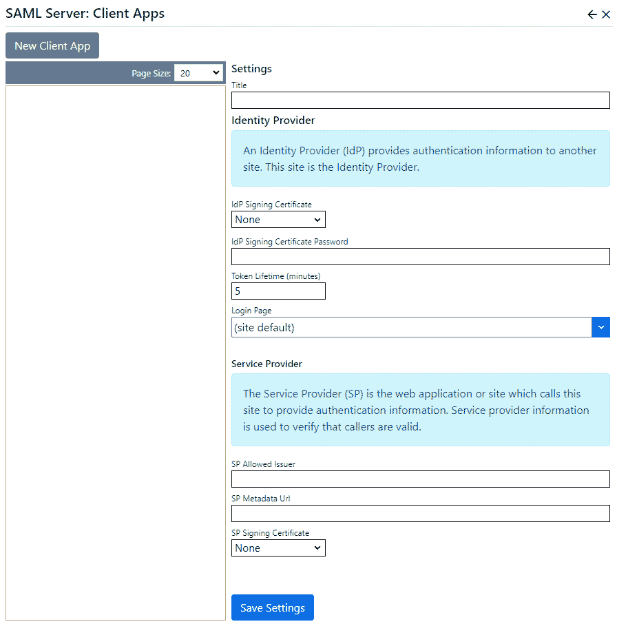

## SAML server
The SAML server extension implements the SAML2 protocol to provide authentication (single-signon) services to other web sites 
and applications.  Users can use their Nucleus credentials to access web sites which are configured to use Nucleus as their SAML2 
identity provider.

> The SAML server extension is open-source, but it is not free.  It can be purchased from [Inventua](http://www.inventua.com).

> There is a free SAML client extension for Nucleus.  Your SAML client (Service Provider) can also be any other 
software which supports SAML2.

## SAML2 Overview
The Nucleus OAuth Server extension implements the [SAML2](https://en.wikipedia.org/wiki/SAML_2.0) protocol.  SAML2 
replaced the version 1.1 of the SAML protocol in 2005.  In this documentation, and in many other references, 
the term "SAML" is used to mean "SAML2".  

With the SAML server extension, Nucleus acts as a SAML2 [Identity Provider](https://en.wikipedia.org/wiki/Identity_provider_(SAML)#:~:text=A%20SAML%20identity%20provider%20is,entity%20that%20issues%20SAML%20assertions.). 
The SAML2 protocol defines an [Identity Provider](https://en.wikipedia.org/wiki/Identity_provider_(SAML)#:~:text=A%20SAML%20identity%20provider%20is,entity%20that%20issues%20SAML%20assertions.) as 
a system which receives SAML authentication requests and responds with a SAML authentication assertion.  Authentication 
assertions contain information on authentication success or failure, along with the user's identity and other information. 

In SAML, the system which makes authentication requests is called a [Service Provider](https://en.wikipedia.org/wiki/Service_provider_(SAML)). 
SAML also defines the term "Relying Party" as a system which receives and accepts information from another system.  In 
practical terms, a SAML "Relying Party" usually means the same thing as "Service Provider".

### Request and Response Signing Certificates
SAML Request and Response messages can be signed.  Signing messages using a digital certificate allows the 
receiving party to ensure that the content of the message has originated from the expected source, and has not 
been modified.  Enabling signing of SAML request and response messages by configuring a signing certificate 
is highly recommended.  You will have two certificates, and four certificate files (two for each cerfificate).

{.table-25-75}
|                           |                                                                                      |
|---------------------------|--------------------------------------------------------------------------------------|
| **Identity Provider**  |  
| - Certificate with Private key  | Used to sign authorization response messages.  This certificate file contains the private key, so it can be used to sign messages.  This is installed on the Identity Provider's server either as a file, or in the certificate store.  The file type typically has a .pfx extension.
| - Certificate with Public key only  | Used to validate signed authorization response messages.  This is the same certificate as the Identity Provider's "Certificate with Private key" but does not contain the private key. This is installed on the Service Provider's server either as a file, or in the certificate store.  The file type typically has a .cer or .crt extension.
| **Service Provider**  |
| - Certificate with Private key  | Used to sign authorization request messages.  This certificate file contains the private key, so it can be used to sign messages.  This is installed on the Service Provider's server either as a file, or in the certificate store.  The file type typically has a .pfx extension.
| - Certificate with Public key only  |  Used to validate signed authorization request messages.  This is the same certificate as the Service Provider's "Certificate with Private key" but does not contain the private key. This is installed on the Identity Provider's server either as a file, or in the certificate store.  The file type typically has a .cer or .crt extension.

> Take care not to send certificates with a private key outside your organization.  The private key is used to 
sign messages, the certificate with a public key only is used to validate signed messages.

The certificates that you use to sign SAML messages are typically not the same certificate that you use for web 
server SSL.

It is common practise to use a self-signed digital certificate to sign SAML messages, so the Nucleus OAuth server 
extension does not validate the signing authority, or check for certificate revocation.

### Identity Provider Metadata
If your SAML service provider supports metadata, the identity provider can call the Service Provider SAML2 metadata 
endpoint to retrieve settings.

### Service Provider Metadata
The SAML server extension has support for SAML metadata.  The metadata endpoint Url is `http(s)://[your-site]/saml2/idp/metadata/[issuer]`, 
where [issuer] is the value that you enter for 'SP Allowed Issuer' (see below).

### Encryption
Most SAML services use SSL/TSL (https).  This is highly recommended, because TLS will verify the identity of 
your server, and your request and response messages will be encrypted.  The Nucleus SAML Server extension does 
not encrypt messages, because using SSL achieves the same objective.

### Bindings
Your "Service Provider" application may have options to select which SAML2 "bindings" can be used 
for requests and responses.  The Nucleus SAML Server extension supports:

{.table-25-75}
|                                   |                                                                                      |
|-----------------------------------|--------------------------------------------------------------------------------------|
| Authentication Requests           | The SAML Server extension can accept requests which use HTTP-POST and HTTP-Redirect binding.  |
| Authentication Responses          | The SAML Server extension can supply responses using HTTP-POST or HTTP-Artifact binding.  |
| Artifact Resolution               | The SAML Server extension can accept requests and supplies a result using SOAP binding. |

### NameID format
Your "Service Provider" application may have an option to specify which value is returned in the SAML assertion 
NameID element.  The Nucleus SAML2 extension supports:

{.table-25-75}
|                                   |                                                                                      |
|-----------------------------------|--------------------------------------------------------------------------------------|
| urn:oasis:names:tc:SAML:1.1:nameid-format:emailAddress    | The user's email address.  |
| urn:oasis:names:tc:SAML:1.1:nameid-format:X509SubjectName | The user's username.  |
| urn:oasis:names:tc:SAML:2.0:nameid-format:persistent      | The user's user id (guid).  |
| urn:oasis:names:tc:SAML:1.1:nameid-format:unspecified     | The user's user id (guid).  |

### SAML Assertions
A successful SAML2 authentication response will include assertion attributes which include the username, user id, roles 
and values from the user's profile.  Each attribute has a name which identifies what property the attribute represents, and a value.

{.table-25-75}
| Name                              | Value                                                                                |
|-----------------------------------|--------------------------------------------------------------------------------------|
| http://schemas.xmlsoap.org/ws/2005/05/identity/claims/nameidentifier    | The user's user id (guid).  |
| http://schemas.xmlsoap.org/ws/2005/05/identity/claims/name              | The user's username.  |
| http://schemas.microsoft.com/ws/2008/06/identity/claims/role            | The names of the roles which the user belongs to, separated by commas.  |
| User profile properties     | The names used for other profile properties are configured in the Manage/Site page, in User Profile Properties tab.  |

## Settings
For each Service Provider that will be using your SAML Identity Provider, you must create a "Client App", which 
has configuration settings which are specific to each Service Provider.

The SAML server extension settings are accessed in the `Manage` control panel. 

{.table-25-75}
|                                   |                                                                                      |
|-----------------------------------|--------------------------------------------------------------------------------------|
| Title                             | The Client App title is for your reference only.  |
| **Identity Provider**             | |
| IdP Signing Certificate           | Select the source (Store or File) and  select your certificate or enter the filename for your IdP signing certificate.  This certificate must contain a private key. |
| IdP Signing Certificate Password  | Enter the certificate password.  This setting is only available when the certificate source is a file, and you should leave it blank if the file is not password-protected. |
| Token Lifetime                    | Specifies the expiry time (in minutes) of the token which is saved to the database during authentication, and the lifetime of SAML assertions in authentication responses.  The token is used to store data which is used when returning from the login page.  The token lifetime should be short, but long enough for a user to log in and complete SAML authentication.  Default: 5 minutes. |
| Login Page                        | (optional)  Specifies an alternative login page to use for authentication.  An alternative page can contain content which is specific to a particular Service Provider.  The page should contain a login module.   |
|                                   | |
| **Service Provider**              | |
| SP Allowed Issuer                 | Enter the issuer name which the Service Provider will use when sending an authorization request.  This is normally the domain name of the server that the Service Provider application runs on.  Note:  The Identity Provider also supplies an "Issuer" value, and this is different to the "Issuer" which the Service Provider supplies.   |
| SP Metadata Url                   | (optional)  Specify the endpoint Url which the Service Provider uses to publish SAML metadata, which is configuration data required to automatically negotiate agreements between the Service Provider and Identity Provider.  You can leave this value blank if your Service Provider does not provide metadata. |
| SP Signing Certificate            | Select the source (Store or File) and select your certificate or enter the filename for your SP signing certificate.  This certificate does not need to contain a private key. |

> You must install certificates (whether stored in a certificate store, or as a file) manually, using the tools 
available for your operating system.  If you are using a certificate store, the certificates must be installed in 
the "Local Computer/Personal" certificate store, which is sometimes referred to as the "Local Machine/My" store. If you 
are using Azure App Service, you can upload your certificates in your App Service/TLS/SSL settings page - use the 
"Private Key Certificates" tab to upload your IdP signing certificate, and the "Public Key Certificates" tab to 
upload your SP signing certificate.  If you want to use certificate files in an Azure App Service,   If you are using Linux to host Nucleus, you will install certificates by 
copying certificate files to a folder and selecting "File" as the certificate source, and entering the folder and filename.

## Scheduled Task
The SAML server extension includes a scheduled task which must be configured in the `Settings` control panel.  The scheduled task 
deletes expired client app tokens from the database.  The suggested settings are: 

{.table-25-75}
|                                   |                                                                                      |
|-----------------------------------|--------------------------------------------------------------------------------------|
| Name                              | Remove Expired SAML Tokens                       |
| Task                              | Nucleus SAML Server: Clean up Expired Tokens     |
| Enabled                           | Yes                                              |
| Interval                          | 2 Hours                                          |
| Instance Type                     | Per Instance                                     |
| Keep History                      | 10                                               |

> You may choose to reduce the scheduled task interval to as little as 5 minutes if your server is processing a lot of authentication requests.

## Troubleshooting
"Keyset does not exist" when using a signing certificate from the certificate store.
- There is no private key attached to the public key (you intalled a certificate which did not contain a private key).  Re-install the correct certificate (.pfx or .p12 format).
- The user which is running Nucleus does not have read rights to the private key.  The user which is running Nucleus 
is normally `IIS_AppPool\[your-apppool-name]` if you are hosting using IIS, your personal account if you are running 
interactively, or the user which you configured to run Nucleus if you are running in Linux, or have specified a different 
user in IIS.  Log in as an administrator and use the `System` page to view the user - shown as "Operating System user". \
\
To set permissions in Windows:
    1. Run the Microsoft Management console - open a command prompt and type 'mmc.exe'
    2. In MMC, select the 'File' > 'Add/Remove Snap-in' menu item.
    3. Select Certificates from the list of available snap-ins, then click 'Add'.
    4. When prompted, select 'Computer account', then 'Local Computer'.  Click 'Finish'.
    5. In the tree view, select 'Certificates (Local Computer) > Personal > Certificates.
    6. Right-click the certificate and select ''All Tasks'' > 'Manage Private Keys'.
    7. Select a user or group, or click 'Add' to add a new one.
    8. Select the "Read" checkbox.  Click OK.

